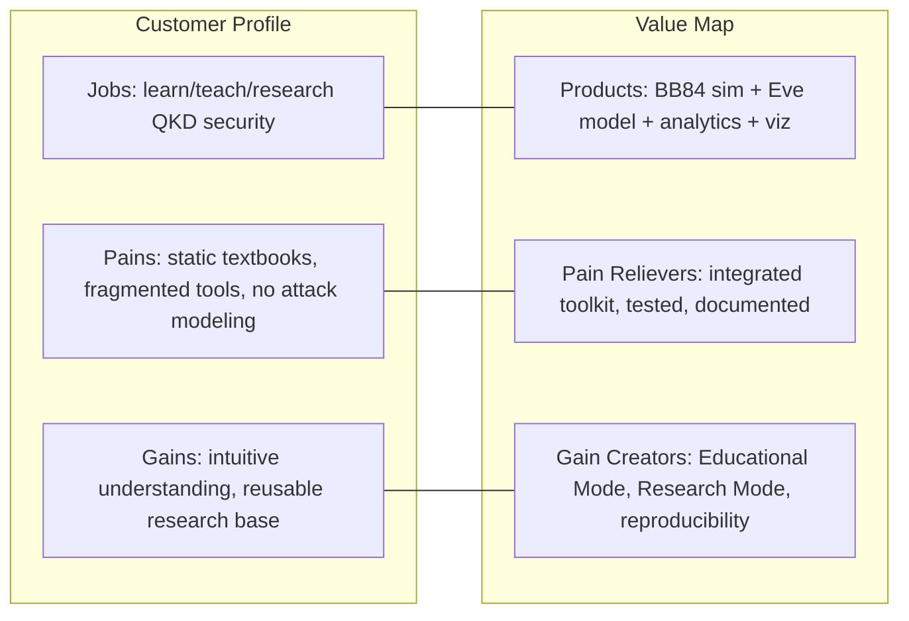
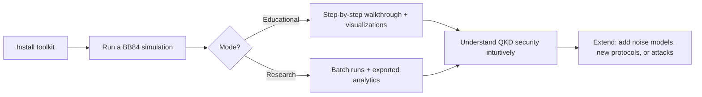

# 02 — Product Blueprint

**Version:** 0.2.0 | **Last Updated:** 2026-07-22 | **Author:** ParaDise
**Status:** Design (Pre-Development) | **References:** `00_PROJECT_CONSTITUTION.md`, `01_REPOSITORY_AUDIT.md`

---

## Table of Contents
1. [Product Overview](#1-product-overview)
2. [Business Goals](#2-business-goals)
3. [Success Metrics & Product KPIs](#3-success-metrics--product-kpis)
4. [Target Audience](#4-target-audience)
5. [Personas (Detailed)](#5-personas-detailed)
6. [User Stories](#6-user-stories)
7. [Value Proposition Canvas](#7-value-proposition-canvas)
8. [Core Features](#8-core-features)
9. [Feature Prioritization (MoSCoW / RICE)](#9-feature-prioritization-moscow--rice)
10. [User Journey](#10-user-journey)
11. [Long-Term Vision](#11-long-term-vision)
12. [Competitive Advantages](#12-competitive-advantages)
13. [Assumptions](#13-assumptions)
14. [Scope](#14-scope)
15. [References](#15-references)
16. [Glossary](#16-glossary)

---

## 1. Product Overview

Quantum Security Toolkit (QST) is a Python/Qiskit-based open-source toolkit for simulating, visualizing, and teaching quantum-secure communication — centered on the BB84 Quantum Key Distribution protocol, with attack simulation and security analytics layered on top.

**Current implementation state: none.** This blueprint describes the intended product.

## 2. Business Goals

As an open-source educational/research project rather than a commercial product, "business goals" are reframed as **impact goals**:

- Become a reference implementation cited in quantum security coursework.
- Lower the barrier for students to *see* QKD security properties (eavesdropper detection via QBER) rather than only read about them.
- Provide researchers a extensible simulation base rather than a one-off toy demo.
- Build maintainer/contributor credibility for the project owner in quantum computing and cybersecurity communities.

## 3. Success Metrics & Product KPIs

> **Status: Planned** — no telemetry or usage data exists yet (project is pre-development). These are the metrics QST will track once released, not current numbers.

### 3.1 Adoption Metrics

| Metric | Definition | Target (v1.0, illustrative) |
|---|---|---|
| PyPI downloads | Monthly package installs | Track only — no fixed target for v1.0 |
| GitHub Stars | Community interest signal | Track only |
| Forks | Indicator of reuse/extension | Track only |
| Contributors | Unique PR authors (excluding maintainer) | ≥1 external contributor within 6 months of v1.0 |
| University citations/adoptions | Known course usage (self-reported or discovered) | Track only |

### 3.2 Product KPIs (Engagement/Quality)

| KPI | Definition | Source |
|---|---|---|
| Educational Mode completion rate | % of users who run a full walkthrough without error | Would require opt-in, privacy-respecting telemetry — **Future**, not built by default (see `11_SECURITY_ARCHITECTURE.md` — no unsolicited data collection) |
| Issue resolution time | Median time from issue opened to closed | GitHub metadata, once repo exists |
| Test coverage trend | % coverage over time | CI reports (`14_TESTING_STRATEGY.md`) |
| Documentation freshness | Days since last `docs/` update vs. last code change | Manual/CI check |

### 3.3 Measurement Principle

No metric requiring user data collection will be implemented without being explicitly opt-in and documented — consistent with `00_PROJECT_CONSTITUTION.md` principle of no fabricated/hidden behavior. Default metrics are all derivable from public GitHub/PyPI metadata, which requires no instrumentation of the toolkit itself.

## 4. Target Audience

| Segment | Need |
|---|---|
| Students | Clear, visual, correct BB84 walkthroughs for coursework |
| Researchers | Extensible simulation core for experiments (noise models, alternate protocols) |
| Security Engineers | Understanding of quantum-safe communication concepts and attack surfaces |
| Quantum Developers | A well-structured Qiskit codebase to learn from or build on |
| Universities | A teaching tool / lab exercise base |
| Industry Professionals | Conceptual grounding in post-quantum / quantum-secure communication trends |

## 5. Personas (Detailed)

> Expands §4 with named personas used consistently across `12_UI_UX_DESIGN.md` and this document.

### Persona: Ananya — Undergraduate Student
- **Background:** Third-year CS/cybersecurity student, comfortable with Python, new to quantum computing.
- **Goal:** Pass a quantum cryptography lab assignment; genuinely understand *why* eavesdropping is detectable, not just memorize the answer.
- **Frustration today:** Textbook diagrams are static; she can't experiment with "what if Eve intercepts only 50% of qubits?"
- **Success looks like:** Runs `qst simulate --eve-prob 0.5`, sees the QBER rise, and can explain the physics to a TA in her own words.

### Persona: Dr. Verma — Quantum Security Researcher
- **Background:** PhD-level, familiar with Qiskit, wants to explore QBER distributions under different noise assumptions.
- **Goal:** Run parameter-sweep batch experiments and export raw data for statistical analysis in a separate tool (e.g., pandas, R).
- **Frustration today:** Existing single-purpose scripts don't expose batch/export functionality; she'd have to write her own harness.
- **Success looks like:** Uses `qst batch` (Planned) to sweep `eve-prob` from 0 to 1 and exports a clean CSV for her own analysis pipeline.

### Persona: Rahul — Security Engineer
- **Background:** Strong classical security background, limited quantum exposure.
- **Goal:** Build intuition for QKD before a client conversation or conference talk about "quantum-safe" claims.
- **Frustration today:** Marketing material about "quantum-safe" is often vague; he wants a concrete, runnable demonstration.
- **Success looks like:** Runs Educational Mode once, walks away able to explain the no-cloning-theorem argument correctly.

## 6. User Stories

> Format: *As a [persona], I want [capability], so that [outcome].* All stories below map to Functional Requirements in `05_PRODUCT_REQUIREMENTS.md` (see FR IDs referenced).

| ID | Story | Maps to |
|---|---|---|
| US-1 | As Ananya, I want to run a BB84 simulation with a fixed seed, so that I can reproduce the exact same result my TA sees. | FR-1, FR-2, FR-12 |
| US-2 | As Ananya, I want a step-by-step narrated walkthrough, so that I understand each protocol phase before moving to the next. | FR-10 |
| US-3 | As Dr. Verma, I want to run 1,000 simulations with varying eavesdropping probability and export results, so that I can plot QBER vs. interception rate myself. | FR-9, FR-11 |
| US-4 | As Rahul, I want to see a clear QBER spike when Eve is enabled, so that I can visually confirm the security claim. | FR-5, FR-8 |
| US-5 | As any user, I want invalid parameters (e.g., negative qubit count) to fail with a clear error rather than silently producing wrong results, so that I trust the tool's output. | FR-11 (validation), `11_SECURITY_ARCHITECTURE.md` §6 |

## 7. Value Proposition Canvas

| Customer Pains | Pain Relievers (QST) |
|---|---|
| Static, non-interactive teaching material | Runnable, parameterized simulation |
| No attack modeling in typical tutorials | Built-in Eavesdropper model (FR-5) |
| Fragmented tooling for sim + analytics + viz | Single integrated, documented toolkit |
| Hard to reproduce results across users | Seed-based reproducibility (FR-12) |

## 8. Core Features

> All features below are **Planned** — none are implemented yet.

- **BB84 Simulation Engine** — full protocol: qubit preparation, basis choice, measurement, sifting, error estimation, key reconciliation.
- **Eavesdropper (Eve) Simulation** — intercept-resend attack model, configurable interception probability.
- **Security Analytics** — QBER computation, key rate, eavesdropper-detection probability, statistical confidence.
- **Visualization** — Bloch sphere / basis diagrams, sifting tables, QBER-vs-interception-rate charts.
- **Educational Mode** — step-by-step walkthrough with annotations for learners.
- **Research Mode** — batch simulation runs, exportable raw data (CSV/JSON) for external analysis.

## 9. Feature Prioritization (MoSCoW / RICE)

### 9.1 MoSCoW

| Feature | Priority |
|---|---|
| BB84 Simulation Engine | Must |
| Eavesdropper Simulation | Must |
| Security Analytics (QBER, key rate) | Must |
| CLI | Must |
| Educational Mode narration | Should |
| Visualization | Should |
| Research/Batch Mode + export | Should |
| Web dashboard | Won't (v1.0) — Future per `20_FUTURE_ENHANCEMENTS.md` |
| AI Tutor | Won't (v1.0) — Future per `08_AI_ARCHITECTURE.md` |

### 9.2 RICE Scoring (Reach, Impact, Confidence, Effort)

| Feature | Reach (1-10) | Impact (1-10) | Confidence (1-10) | Effort (person-weeks, est.) | RICE Score (R×I×C/E) |
|---|---|---|---|---|---|
| BB84 Simulation Engine | 10 | 10 | 9 | 3 | 300 |
| Eavesdropper Simulation | 9 | 10 | 9 | 1.5 | 540 |
| Security Analytics | 9 | 9 | 9 | 1 | 729 |
| Visualization | 7 | 6 | 7 | 1.5 | 196 |
| Educational Mode | 8 | 8 | 7 | 2 | 224 |
| Research/Batch Mode | 5 | 6 | 7 | 2 | 105 |

> **Note:** Effort estimates are the project owner's rough planning-level judgment, not measured. RICE scores here corroborate (rather than override) the phase sequencing already fixed in `15_ROADMAP.md` — Eavesdropper Simulation and Security Analytics score highest, matching their placement in Phase 1.

## 10. User Journey

## 11. Long-Term Vision

Restated from `00_PROJECT_CONSTITUTION.md`: to become the most comprehensive open-source educational and research toolkit for quantum-secure communication, BB84 simulation, quantum cryptography visualization, attack simulation, and quantum security education.

## 12. Competitive Advantages

Framed honestly, as **intended differentiators** rather than proven advantages (no comparative benchmarking has been done yet — see `04_MARKET_RESEARCH.md`):

- Combines simulation **and** attack modeling **and** analytics **and** visualization in one coherent toolkit, rather than a single-purpose demo script.
- Dual educational/research mode design from day one, rather than bolted on later.
- Documentation-first development means the architecture is auditable and extensible from the first release.

## 13. Assumptions

- Users have basic Python familiarity; deep quantum computing background is not assumed for Educational Mode users.
- Qiskit remains the primary simulation backend for the foreseeable roadmap (see `18_DECISION_LOG.md` if this changes).
- No usage telemetry is collected without explicit opt-in (see §3.3).

## 14. Scope

Covers product-level vision and features. Detailed functional/non-functional requirements are in `05_PRODUCT_REQUIREMENTS.md`.

## 15. References

- `00_PROJECT_CONSTITUTION.md`
- `03_PROBLEM_STATEMENT.md`
- `05_PRODUCT_REQUIREMENTS.md`
- `15_ROADMAP.md`
- `12_UI_UX_DESIGN.md` (personas reused here)

## 16. Glossary

| Term | Definition |
|---|---|
| Sifting | The BB84 step where sender and receiver discard bits measured in mismatched bases. |
| Intercept-resend attack | An eavesdropping strategy where Eve measures and retransmits qubits, introducing detectable errors. |
| RICE | A feature-prioritization scoring model: Reach × Impact × Confidence ÷ Effort. |
| MoSCoW | A prioritization framework: Must, Should, Could, Won't have. |

---

## Implementation Status

| Feature | Status |
|---|---|
| BB84 Simulation Engine | Planned |
| Eavesdropper Simulation | Planned |
| Security Analytics | Planned |
| Visualization | Planned |
| Educational / Research Modes | Planned |
| Adoption/KPI tracking | Planned (public-metadata-only by default) |

## Future Improvements

- Support for additional QKD protocols (e.g., E91, B92) once BB84 core is stable.
- Community-contributed noise models for realistic hardware simulation.
- Opt-in, privacy-respecting usage analytics if community demand justifies the added complexity.

## Document Improvements

This revision (0.2.0) added: Success Metrics & Product KPIs (§3), detailed Personas (§5), User Stories mapped to FRs (§6), a Value Proposition Canvas (§7), and Feature Prioritization via MoSCoW and RICE (§9). All original content (Product Overview, Business Goals, Target Audience, Core Features, User Journey, Long-Term Vision, Competitive Advantages, Assumptions, Scope, References, Glossary) is preserved unchanged; the document was renumbered to accommodate new sections in a logical position.
