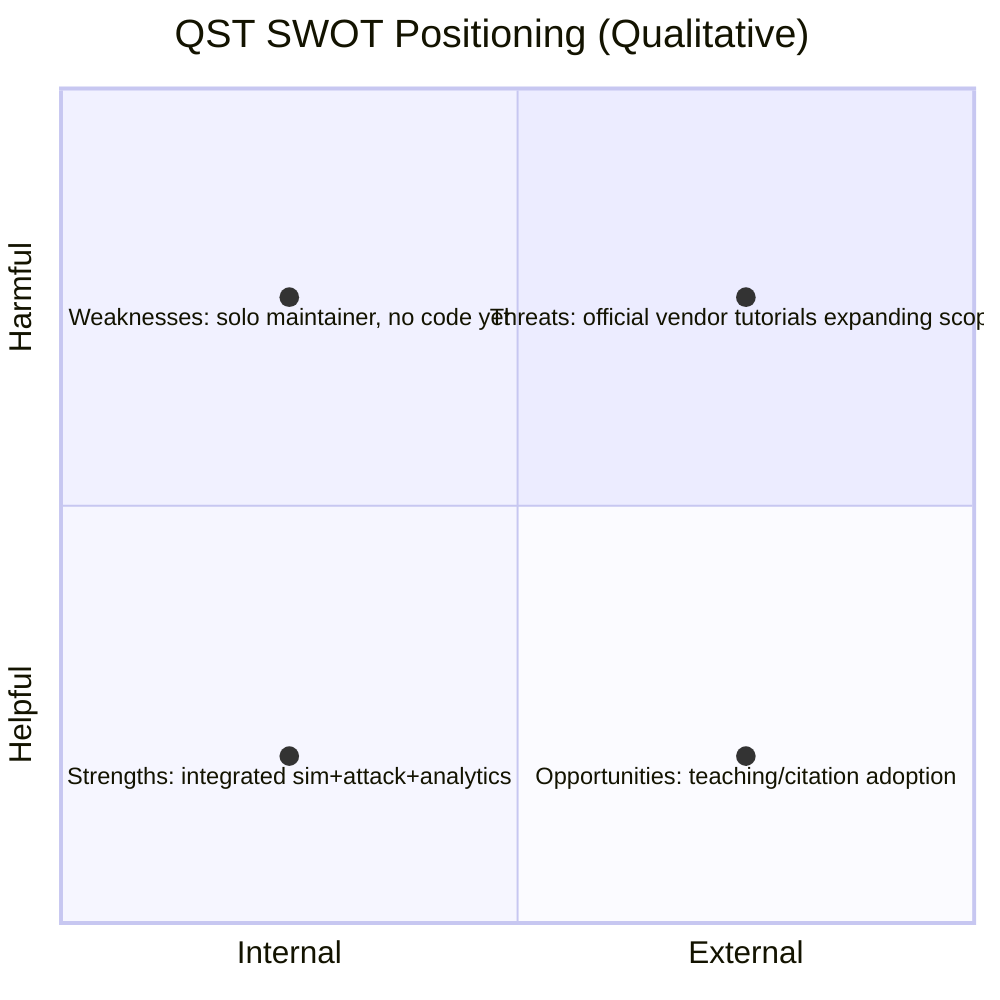

# 04 — Market Research

**Version:** 0.1.0 | **Last Updated:** 2026-07-22 | **Author:** ParaDise
**Status:** Design (Pre-Development) | **References:** `03_PROBLEM_STATEMENT.md`

---

## Table of Contents
1. [Industry Overview](#1-industry-overview)
2. [Quantum Security / Education Landscape](#2-quantum-security--education-landscape)
3. [Comparable Projects](#3-comparable-projects)
4. [Comparison Table](#4-comparison-table)
5. [Opportunities](#5-opportunities)
6. [SWOT Analysis](#6-swot-analysis)
7. [Future Trends](#7-future-trends)
8. [Assumptions](#8-assumptions)
9. [Scope](#9-scope)
10. [References](#10-references)

---

## 1. Industry Overview

Quantum computing education and quantum-safe security awareness are both active, growing areas, driven by (a) increasing academic investment in quantum computing curricula and (b) organizational concern over "harvest now, decrypt later" threats to classical cryptography from future quantum computers. QKD/BB84 sits at the intersection of both trends as a teaching vehicle and a real (if niche-deployed) security technology.

> **Note:** No formal market-sizing research has been conducted for this project. The statements above reflect general, well-established industry context, not proprietary research. Anything requiring current statistics should be verified via live search before being cited externally.

## 2. Quantum Security / Education Landscape

- Major quantum vendors (IBM Quantum, others) publish open Qiskit tutorials including BB84-style demonstrations, primarily as documentation/education content rather than standalone toolkits.
- University quantum computing courses frequently include a BB84 lab exercise, often built ad hoc per institution.
- Post-quantum cryptography (PQC) — distinct from QKD — has separate, more commercially mature tooling (e.g., liboqs) driven by NIST PQC standardization.

## 3. Comparable Projects

| Project Type | Example Category | Overlap with QST |
|---|---|---|
| Qiskit official tutorials/notebooks | IBM Quantum documentation | Protocol correctness reference; not a packaged toolkit |
| University lab code (unpublished/ad hoc) | Various | Not centrally maintained or reusable |
| General quantum simulators | Qiskit Aer, Cirq | Infrastructure QST would build on, not a competing product |
| PQC libraries | liboqs, Open Quantum Safe project | Different technology (classical PQC, not QKD) — complementary domain, not a direct competitor |

> Specific named third-party BB84 educational toolkits are **not enumerated here** to avoid making unverified claims about competitors' feature sets. A rigorous competitive audit (naming specific repos with live links) is **To Be Implemented** as a follow-up research task before any public "how we compare" marketing claim is made.

## 4. Comparison Table

| Capability | Typical tutorial notebook | QST (Planned) |
|---|---|---|
| BB84 protocol simulation | ✅ | ✅ Planned |
| Eavesdropper/attack modeling | Rare | ✅ Planned |
| Security analytics (QBER, key rate) | Rare | ✅ Planned |
| Visualization layer | Sometimes | ✅ Planned |
| Packaged, tested, documented toolkit | Rare | ✅ Planned |

## 5. Opportunities

- Fill the gap between "single tutorial notebook" and "full packaged, tested, documented toolkit."
- Serve as a portfolio-grade open-source project demonstrating combined quantum + security engineering skill.
- Potential to become a citable teaching resource for university courses.

## 6. SWOT Analysis

| Strengths | Weaknesses |
|---|---|
| Combined sim + attack + analytics + viz scope | No implementation exists yet |
| Documentation-first, auditable architecture | Single maintainer, limited bandwidth |

| Opportunities | Threats |
|---|---|
| University adoption as teaching tool | Official Qiskit tutorials could expand to cover the same ground |
| Portfolio/credibility building | Maintainer bandwidth risk (see `17_RISK_REGISTER.md`) |

## 7. Future Trends

- Growing NIST PQC standardization adoption may increase general interest in quantum-era cryptography, indirectly benefiting QKD education tools.
- Increased academic access to real quantum hardware (via cloud providers) could allow QST to eventually run against real devices, not just simulators (Future).

## 8. Assumptions

- No proprietary market data was purchased or accessed; all statements above are general industry knowledge, explicitly flagged where unverified.

## 9. Scope

Qualitative landscape only. Does not constitute a legal or investment-grade market analysis.

## 10. References

- `03_PROBLEM_STATEMENT.md`
- `02_PRODUCT_BLUEPRINT.md`

---

## Implementation Status

| Item | Status |
|---|---|
| Named competitor audit with live links | To Be Implemented |
| Formal market sizing | To Be Implemented |

## Future Improvements

- Run a live web-search-backed competitor audit before any public comparison claims are published.
