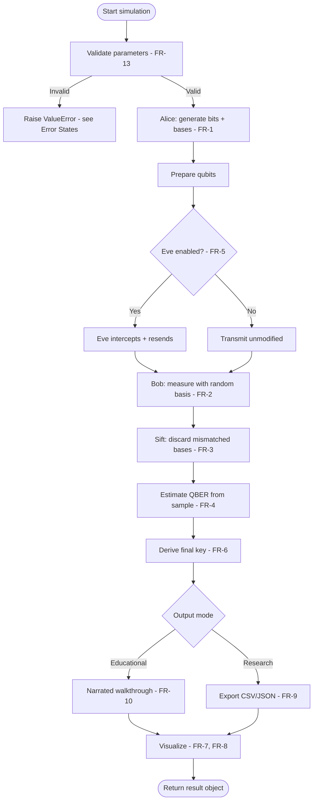

# 05 — Product Requirements Document (PRD)

**Version:** 0.2.0 | **Last Updated:** 2026-07-22 | **Author:** ParaDise
**Status:** Design (Pre-Development) | **References:** `02_PRODUCT_BLUEPRINT.md`, `03_PROBLEM_STATEMENT.md`

---

## Table of Contents
1. [Functional Requirements](#1-functional-requirements)
2. [Non-Functional Requirements](#2-non-functional-requirements)
3. [Business Requirements](#3-business-requirements)
4. [User Stories](#4-user-stories)
5. [Functional Flow](#5-functional-flow)
6. [Edge Cases](#6-edge-cases)
7. [Error States](#7-error-states)
8. [Constraints](#8-constraints)
9. [Success Criteria](#9-success-criteria)
10. [Acceptance Criteria](#10-acceptance-criteria)
11. [Traceability Matrix (FR → Architecture → Tests)](#11-traceability-matrix-fr--architecture--tests)
12. [Assumptions](#12-assumptions)
13. [Scope](#13-scope)
14. [References](#14-references)
15. [Glossary](#15-glossary)

---

## 1. Functional Requirements

All items below are **Planned** (none implemented).

| ID | Requirement | Priority |
|---|---|---|
| FR-1 | System shall simulate BB84 qubit preparation with random bit/basis choice for Alice | Must |
| FR-2 | System shall simulate Bob's random basis measurement | Must |
| FR-3 | System shall perform basis reconciliation (sifting) | Must |
| FR-4 | System shall estimate QBER from a sample of sifted bits | Must |
| FR-5 | System shall simulate an optional intercept-resend eavesdropper (Eve) with configurable interception probability | Must |
| FR-6 | System shall compute final shared key length (post-sifting, post-error-estimation) | Must |
| FR-7 | System shall visualize basis/measurement outcomes (e.g., table or chart) | Should |
| FR-8 | System shall visualize QBER vs. eavesdropping probability | Should |
| FR-9 | System shall support batch/research-mode runs with exportable CSV/JSON results | Should |
| FR-10 | System shall provide a step-by-step "Educational Mode" narrated walkthrough | Should |
| FR-11 | System shall allow configurable qubit count per run | Must |
| FR-12 | System shall allow configurable random seed for reproducibility | Must |
| FR-13 | System shall validate all numeric inputs and reject invalid ranges with a descriptive error (see §7 Error States) | Must |

## 2. Non-Functional Requirements

| ID | Requirement |
|---|---|
| NFR-1 | Simulations of up to 10,000 qubits shall complete in under 30 seconds on a standard laptop CPU (Aer simulator, no real hardware) — **target, not yet benchmarked** |
| NFR-2 | Codebase shall maintain ≥80% test coverage on core simulation logic (see `14_TESTING_STRATEGY.md`) |
| NFR-3 | All public APIs shall have type hints and docstrings |
| NFR-4 | Documentation shall remain in sync with code (no stale `docs/`) |
| NFR-5 | Toolkit shall run on Linux, macOS, and Windows (via Python + Qiskit's supported platforms) |

## 3. Business Requirements

Reframed for an open-source educational project (see `02_PRODUCT_BLUEPRINT.md` §2):

- BR-1: Project must remain free and open-source (license TBD — see `18_DECISION_LOG.md`).
- BR-2: Documentation must be sufficient for university adoption without direct maintainer support.

## 4. User Stories

> Reproduced here (owned canonically in `02_PRODUCT_BLUEPRINT.md` §6) for direct traceability to FR IDs during implementation — see that document for persona context.

| ID | Story (abbreviated) | FR(s) |
|---|---|---|
| US-1 | Reproducible run via fixed seed | FR-1, FR-2, FR-12 |
| US-2 | Step-by-step narrated walkthrough | FR-10 |
| US-3 | Batch sweep + export for external analysis | FR-9, FR-11 |
| US-4 | Visible QBER spike when Eve enabled | FR-5, FR-8 |
| US-5 | Invalid parameters fail loudly, not silently | FR-13 |

## 5. Functional Flow

## 6. Edge Cases

| ID | Edge Case | Expected Behavior (Planned) |
|---|---|---|
| EC-1 | `n_qubits = 0` | Reject with `ValueError` (FR-13) — no meaningful simulation possible |
| EC-2 | `n_qubits = 1` | Should still run; QBER/statistics will be degenerate (0% or 100%) and this must be documented, not hidden |
| EC-3 | `eve_intercept_probability = 0.0` exactly | Behaves as the no-eavesdropper baseline case; QBER should reflect only simulator noise floor |
| EC-4 | `eve_intercept_probability = 1.0` exactly | Full interception; QBER should approach theoretical ~25% (see `11_SECURITY_ARCHITECTURE.md` §4) |
| EC-5 | All bits sifted out (0 matching bases) | Statistically rare at reasonable `n_qubits`, but must be handled without crashing — return an explicit "empty key" result rather than dividing by zero in QBER calculation |
| EC-6 | Extremely large `n_qubits` (e.g., 10 million) on constrained hardware | Should fail gracefully with a clear resource-limit message rather than an unhandled `MemoryError`, once implemented — exact ceiling is **To Be Implemented/benchmarked** |
| EC-7 | Non-integer or negative `seed` | Reject with `ValueError`, or coerce per Python's `random.seed` semantics — exact behavior **To Be Implemented** and documented in `10_API_SPECIFICATION.md` once decided |

## 7. Error States

| Error Condition | Raised Exception (Planned) | User-Facing Message Style |
|---|---|---|
| Invalid `n_qubits` (≤0, non-integer) | `ValueError` | "n_qubits must be a positive integer" |
| Invalid `eve_intercept_probability` (outside [0,1]) | `ValueError` | "eve_intercept_probability must be between 0.0 and 1.0" |
| Backend/simulator failure (Qiskit Aer error) | `SimulationError` (QST-specific wrapper, per `10_API_SPECIFICATION.md` §6) | "Simulation backend failed: <cause>" — never leak raw stack trace to CLI output by default |
| Empty sifted key (EC-5) | Not an error — a valid `SimulationResult` with `final_key_length = 0` and a `warnings` field | "No bits survived sifting — try a larger qubit count" |

## 8. Constraints

- **No real quantum hardware dependency** for core functionality — must run fully offline via Qiskit Aer (see `06_TECHNICAL_REQUIREMENTS.md`).
- **No network calls** in the core simulation path (see `11_SECURITY_ARCHITECTURE.md` §6).
- **Single-maintainer bandwidth** constrains delivery pace — features are scoped to `15_ROADMAP.md` phases accordingly.
- **Statevector simulation memory scaling** — classical simulation cost grows with simulated qubit count/circuit width; this bounds practical `n_qubits` values pending benchmarking (NFR-1, EC-6).

## 9. Success Criteria

- A learner with basic Python knowledge can run a full BB84 simulation, with and without an eavesdropper, and observe the QBER difference, within their first session.
- A researcher can extend the simulation (e.g., add a noise model) without modifying core protocol logic, due to clean module boundaries (see `07_SYSTEM_ARCHITECTURE.md`).

## 10. Acceptance Criteria

For **FR-1 through FR-6** (the Phase 1 core, per `15_ROADMAP.md`):

- Given a fixed random seed, the simulation produces the same key and QBER on repeated runs.
- Given Eve's interception probability set to 0, expected QBER approaches the simulator's baseline noise floor.
- Given Eve's interception probability set to 1 (full interception), expected QBER approaches the theoretical ~25% for intercept-resend attacks on BB84.
- Unit tests exist verifying the above three conditions before Phase 1 is marked "Done" (see `00_PROJECT_CONSTITUTION.md` §8, Definition of Done).

## 11. Traceability Matrix (FR → Architecture → Tests)

| FR | Architecture Component (`07_SYSTEM_ARCHITECTURE.md`) | Test (`14_TESTING_STRATEGY.md`) |
|---|---|---|
| FR-1 | `BB84Protocol.generate_bits()`, `generate_bases()` | `test_bit_basis_generation_length` |
| FR-2 | `BB84Protocol.measure_qubits()` | `test_bit_basis_generation_length`, `test_reproducibility_with_seed` |
| FR-3 | `BB84Protocol.sift()` | `test_sifting_discards_mismatched_bases` |
| FR-4 | `SecurityAnalytics.compute_qber()` | `test_qber_zero_eve`, `test_qber_full_eve` |
| FR-5 | `Eavesdropper.intercept_and_resend()` | `test_qber_full_eve` |
| FR-6 | `SecurityAnalytics.compute_key_rate()` | Integration test (`14_TESTING_STRATEGY.md` §3) |
| FR-7 | `Visualizer.render_basis_table()` | Not unit-critical (presentation layer, lower coverage target per §14 §6) |
| FR-8 | `Visualizer.plot_qber_vs_interception()` | Same as above |
| FR-9 | `SimulationOrchestrator.run_research_batch()` | Integration test |
| FR-10 | `SimulationOrchestrator.run_educational()` | Integration test |
| FR-11, FR-12 | `SimulationOrchestrator` parameter handling | `test_reproducibility_with_seed` |
| FR-13 | Input validation at API boundary (`10_API_SPECIFICATION.md` §6) | `test_invalid_parameter_validation` |

## 12. Assumptions

- "Standard laptop CPU" performance targets (NFR-1) are estimates and must be validated empirically once implemented; they are not benchmarked claims.
- Edge case behavior for extreme inputs (EC-6, EC-7) is intentionally left "To Be Implemented" pending an actual implementation to test against, rather than guessed at.

## 13. Scope

Requirements only — implementation approach is documented in `06_TECHNICAL_REQUIREMENTS.md` and `07_SYSTEM_ARCHITECTURE.md`.

## 14. References

- `02_PRODUCT_BLUEPRINT.md`
- `06_TECHNICAL_REQUIREMENTS.md`
- `07_SYSTEM_ARCHITECTURE.md`
- `10_API_SPECIFICATION.md`
- `11_SECURITY_ARCHITECTURE.md`
- `14_TESTING_STRATEGY.md`
- `31_CONFIGURATION_REFERENCE.md` — consolidated index of every parameter named in §1's FR table, with defaults and allowed ranges in one place

## 15. Glossary

| Term | Definition |
|---|---|
| Sifted key | The subset of the raw key remaining after discarding bits measured in mismatched bases. |
| Interception probability | The fraction of qubits Eve intercepts and resends in the attack simulation. |
| Traceability matrix | A table mapping requirements to the architecture components and tests that implement/verify them. |

---

## Implementation Status

| Requirement Set | Status |
|---|---|
| FR-1 to FR-6 (Phase 1 core) | Planned |
| FR-7 to FR-10 (Phase 2 UX/analytics) | Planned |
| FR-13 (input validation) | Planned |
| NFR-1 benchmarking | To Be Implemented |
| Edge case handling (§6) | Planned, exact ceilings To Be Implemented |

## Future Improvements

- Add requirements for additional protocols (E91, B92) once BB84 core requirements are fully delivered.
- Benchmark EC-6 (large qubit count) ceilings once Phase 1 lands, and update Constraints (§8) with real numbers.

## Document Improvements

This revision (0.2.0) added: User Stories cross-referenced from `02_PRODUCT_BLUEPRINT.md` (§4), a Functional Flow diagram (§5), Edge Cases (§6), Error States (§7), Constraints (§8), and a full Traceability Matrix linking every FR to its architecture component and test (§11). All original content (Functional/Non-Functional/Business Requirements, Success/Acceptance Criteria, Assumptions, Scope, References, Glossary) is preserved; FR-13 was added to formalize input-validation as its own tracked requirement since Edge Cases/Error States depend on it.
