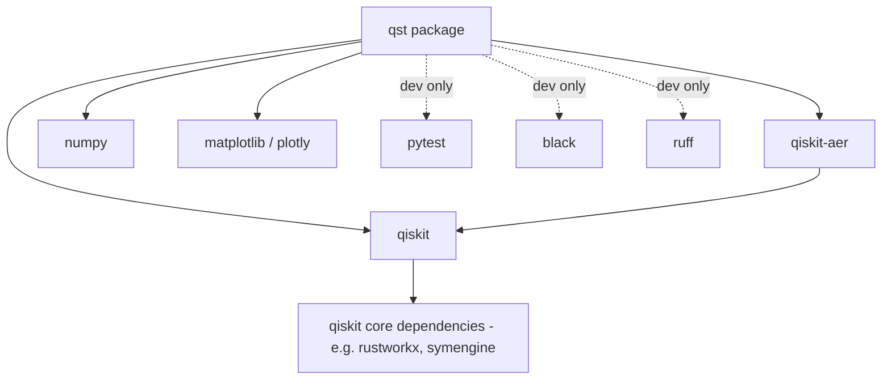

# 06 — Technical Requirements

**Version:** 0.2.0 | **Last Updated:** 2026-07-22 | **Author:** ParaDise
**Status:** Design (Pre-Development) | **References:** `05_PRODUCT_REQUIREMENTS.md`

---

## Table of Contents
1. [Languages](#1-languages)
2. [Frameworks & Libraries](#2-frameworks--libraries)
3. [Dependency Graph](#3-dependency-graph)
4. [System Requirements](#4-system-requirements)
5. [Hardware Constraints](#5-hardware-constraints)
6. [Performance Requirements](#6-performance-requirements)
7. [Compatibility Matrix](#7-compatibility-matrix)
8. [Version Support Policy](#8-version-support-policy)
9. [Packaging Strategy](#9-packaging-strategy)
10. [Dependencies](#10-dependencies)
11. [Assumptions](#11-assumptions)
12. [Scope](#12-scope)
13. [References](#13-references)

---

## 1. Languages

- **Python 3.11+** — primary and only implementation language for the initial roadmap (per `00_PROJECT_CONSTITUTION.md`).

## 2. Frameworks & Libraries

> **Note:** Exact version pins are **To Be Implemented** at repository initialization time, since no `requirements.txt`/`pyproject.toml` exists yet. The libraries below reflect the intended stack per project brief; specific versions must be selected and pinned when the repo is scaffolded, checked against current release/security status at that time.

| Library | Purpose | Status |
|---|---|---|
| `qiskit` | Core quantum circuit construction & simulation | Planned |
| `qiskit-aer` | High-performance quantum simulator backend | Planned |
| `numpy` | Numerical operations for analytics (QBER, statistics) | Planned |
| `matplotlib` and/or `plotly` | Visualization layer | Planned |
| `pytest` | Testing framework | Planned |
| `black`, `ruff` | Formatting & linting | Planned |

## 3. Dependency Graph

**Reading the graph:** `qst` has a hard runtime dependency on `qiskit`, `qiskit-aer`, and `numpy`. Visualization libraries are a runtime dependency only for the `visualization` module (per the layered architecture in `07_SYSTEM_ARCHITECTURE.md`) — a future optimization could make them an optional extra (e.g., `pip install qst[viz]`) rather than a hard requirement, to keep the headless/CI install lighter. This optional-extras decision is **To Be Implemented/decided** at packaging time (see §9).

Transitive dependencies (e.g., Qiskit's own dependency tree) are Qiskit's responsibility to manage; QST's obligation is to pin compatible top-level versions and monitor for breaking changes (see `17_RISK_REGISTER.md` T-1).

## 4. System Requirements

| Requirement | Detail |
|---|---|
| OS | Linux, macOS, Windows (via Python/Qiskit cross-platform support) |
| Python | 3.11 or later |
| RAM | Sufficient for classical simulation of the configured qubit count (grows with simulated state-vector size for statevector-based simulation methods) |
| Quantum hardware | Not required — simulator-only for the initial roadmap; real-hardware execution is **Future** (see `20_FUTURE_ENHANCEMENTS.md`) |

## 5. Hardware Constraints

- **Classical memory scaling:** Qiskit Aer's statevector simulation method scales memory roughly exponentially with the number of *entangled* qubits simulated simultaneously in a single circuit; BB84's per-qubit independent preparation/measurement model means QST does **not** need to hold an exponentially large joint statevector for the whole key at once — each qubit can, in principle, be simulated independently or in small batches. Exact implementation strategy (per-qubit circuits vs. batched circuits) is **To Be Implemented** and should be chosen with this constraint explicitly in mind during Phase 1.
- **CPU-only baseline:** No GPU requirement for v1.0; GPU-accelerated Aer backends are a possible **Future** performance enhancement, not a baseline requirement.
- **No real quantum hardware access required:** deliberate constraint (see `06` §4, `11_SECURITY_ARCHITECTURE.md`) to keep the toolkit usable without cloud credentials or queue wait times.

## 6. Performance Requirements

See `05_PRODUCT_REQUIREMENTS.md` NFR-1. Specific throughput targets must be validated empirically once Phase 1 is implemented; no benchmark data exists yet.

## 7. Compatibility Matrix

> **Status: Planned/To Be Implemented.** No compatibility testing has been performed since no code exists. The matrix below defines what must be *verified* once implementation begins, not results already obtained.

| Python Version | OS | Qiskit Version (illustrative range) | Status |
|---|---|---|---|
| 3.11 | Linux | Latest stable at implementation time | To Be Verified |
| 3.11 | macOS | Latest stable at implementation time | To Be Verified |
| 3.11 | Windows | Latest stable at implementation time | To Be Verified |
| 3.12 | Linux/macOS/Windows | Latest stable at implementation time | To Be Verified |

This matrix should be turned into an actual CI test matrix (GitHub Actions) once `13_DEPLOYMENT.md`'s CI/CD pipeline is implemented.

## 8. Version Support Policy

**Planned policy** (to be adopted at v1.0, not yet in force since no releases exist):

- QST will target the **latest stable Qiskit minor release** at the time of each QST release, plus the prior minor release, for a rolling two-version support window.
- Python version support will follow the officially supported Python versions per Qiskit's own support policy at the time, to avoid QST being more permissive than its core dependency can safely support.
- Breaking Qiskit changes that require a QST major-version bump will be recorded as an ADR in `18_DECISION_LOG.md`.

## 9. Packaging Strategy

- **Distribution format:** standard Python wheel + sdist, published to PyPI (see `13_DEPLOYMENT.md` §2).
- **Build backend:** `pyproject.toml` using a standard backend (e.g., `hatchling` or `setuptools`) — specific choice **To Be Implemented** at repository scaffolding time; recorded as an ADR if it becomes a deliberated decision (`18_DECISION_LOG.md`).
- **Optional extras:** visualization dependencies may be split into an optional extra (e.g., `qst[viz]`) to keep the core install lightweight for CI/headless research use — **To Be Implemented/decided**, see §3.
- **Versioning:** Semantic Versioning, consistent with `19_RELEASE_PLAN.md`.

## 10. Dependencies

External dependency risk (e.g., Qiskit breaking API changes between major versions) is tracked in `17_RISK_REGISTER.md`.

## 11. Assumptions

- Qiskit Aer remains the default simulation backend for the life of the initial roadmap; a switch to another backend would be recorded as an architectural decision in `18_DECISION_LOG.md`.
- PyPI is the assumed distribution channel; no alternative (e.g., Conda-only distribution) has been evaluated.

## 12. Scope

Technical/infrastructure requirements only. Feature requirements are in `05_PRODUCT_REQUIREMENTS.md`.

## 13. References

- `05_PRODUCT_REQUIREMENTS.md`
- `07_SYSTEM_ARCHITECTURE.md`
- `13_DEPLOYMENT.md`
- `17_RISK_REGISTER.md`
- `18_DECISION_LOG.md`

---

## Implementation Status

| Item | Status |
|---|---|
| Dependency pinning | To Be Implemented |
| Dependency graph (above) | Design-level, not yet verified against a real install |
| Compatibility matrix | To Be Verified |
| Version support policy | Planned (not yet in force — no releases exist) |
| Packaging strategy | Planned, some decisions (build backend, optional extras) still open |

## Future Improvements

- Add real quantum hardware execution path (IBM Quantum cloud) as an optional backend once simulator-based core is stable and tested.
- Evaluate Conda-forge distribution once PyPI packaging is stable, for easier install alongside existing scientific-Python environments common among the target researcher/university audience.

## Document Improvements

This revision (0.2.0) added: a Dependency Graph (§3), Hardware Constraints (§5), a Compatibility Matrix (§7), a Version Support Policy (§8), and a Packaging Strategy (§9). All original content (Languages, Frameworks & Libraries, System Requirements, Performance Requirements, Dependencies, Assumptions, Scope, References) is preserved unchanged.
