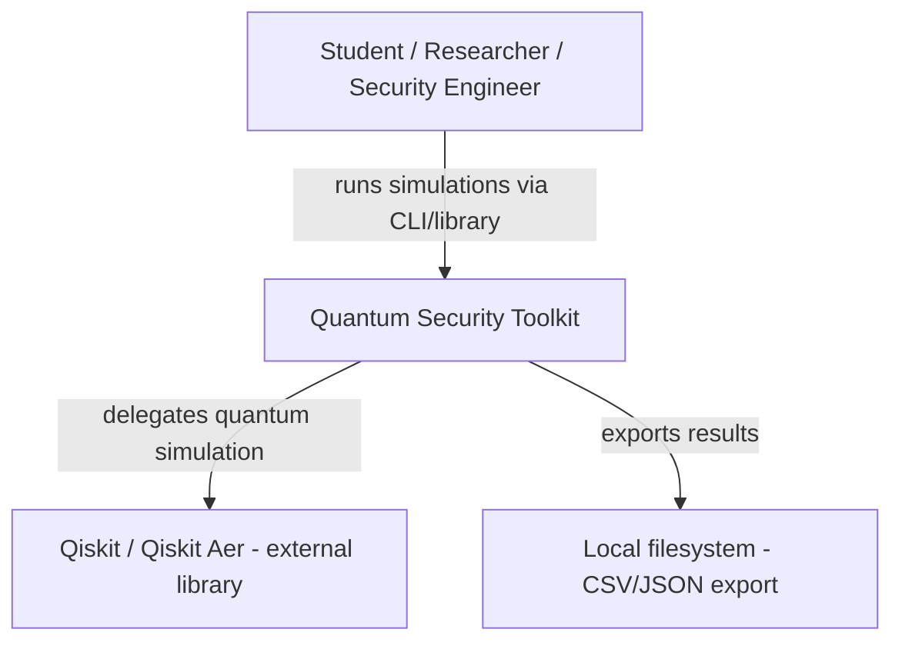
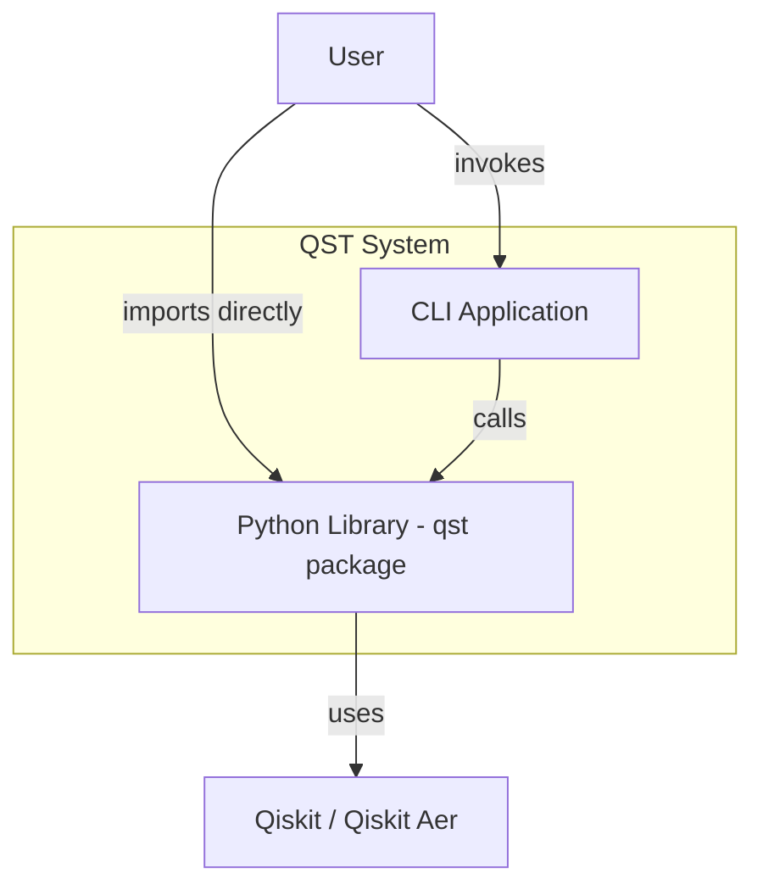
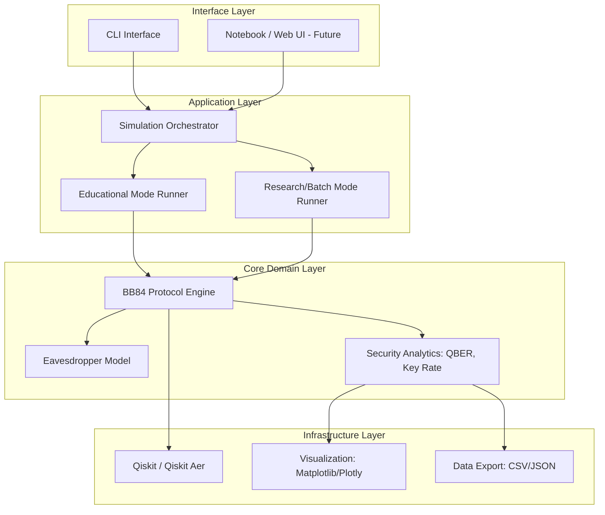
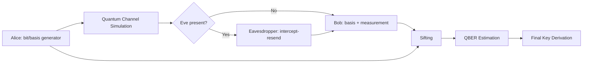
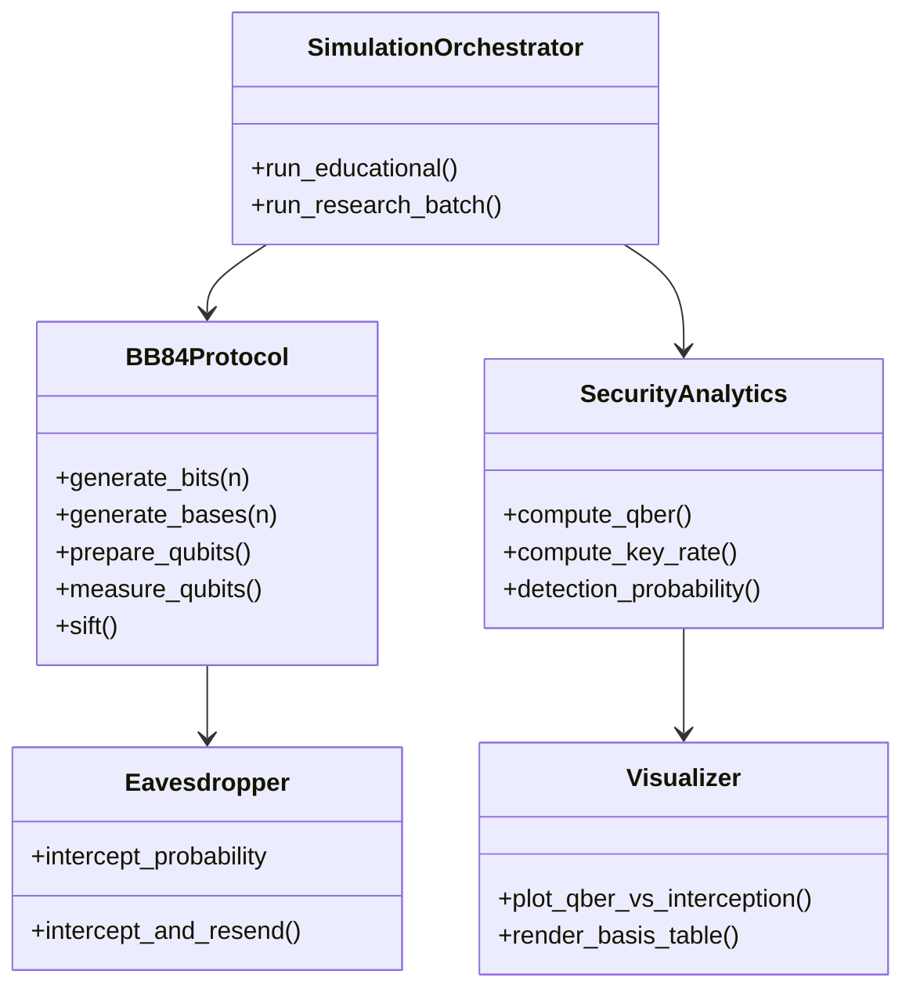
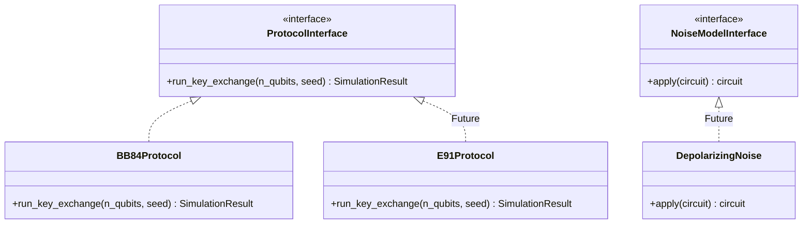
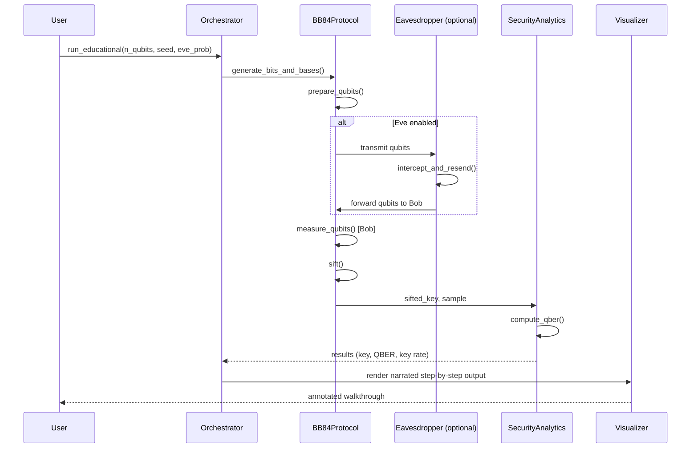
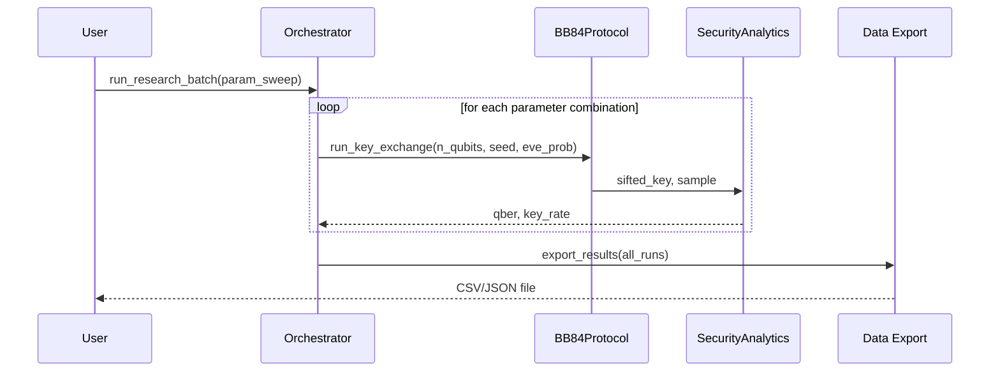
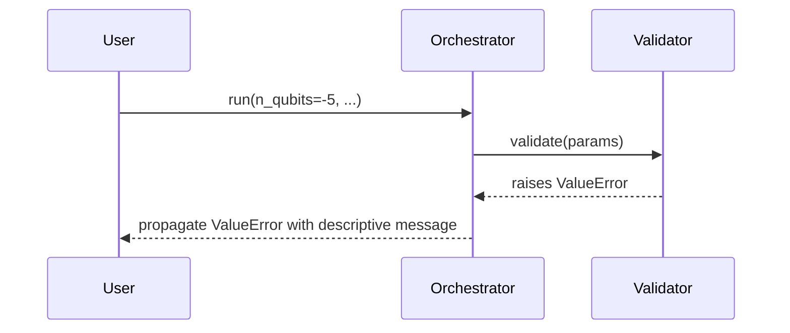

# 07 — System Architecture

**Version:** 0.2.0 | **Last Updated:** 2026-07-22 | **Author:** ParaDise
**Status:** Design (Pre-Development — no code exists; this is the target architecture) | **References:** `06_TECHNICAL_REQUIREMENTS.md`

---

## Table of Contents
1. [Architectural Overview](#1-architectural-overview)
2. [C4 Model](#2-c4-model)
3. [Layered Architecture](#3-layered-architecture)
4. [Component Diagram](#4-component-diagram)
5. [Module Diagram](#5-module-diagram)
6. [Design Patterns Used](#6-design-patterns-used)
7. [Dependency Rules](#7-dependency-rules)
8. [Extension Points & Plugin Architecture](#8-extension-points--plugin-architecture)
9. [Architecture Decision Mapping](#9-architecture-decision-mapping)
10. [Sequence Diagrams — Major Workflows](#10-sequence-diagrams--major-workflows)
11. [Failure Recovery](#11-failure-recovery)
12. [Proposed Folder Structure](#12-proposed-folder-structure)
13. [Assumptions](#13-assumptions)
14. [Scope](#14-scope)
15. [References](#15-references)
16. [Glossary](#16-glossary)

---

## 1. Architectural Overview

QST is designed as a layered, modular Python package: a **quantum simulation core** (Qiskit-based), an **analytics layer** on top of it, a **visualization layer** consuming analytics output, and thin **interface layers** (CLI, and optionally a notebook/web interface in Future phases) on top of all of it. This separation lets the protocol logic be tested and reused independently of how results are displayed.

## 2. C4 Model

### 2.1 Level 1 — System Context



### 2.2 Level 2 — Container



There is only **one deployable container**: the installable Python package itself (no server, no database — see `09_DATABASE_DESIGN.md`, `13_DEPLOYMENT.md`). The CLI is not a separate container; it is a thin entrypoint within the same package.

### 2.3 Level 3 — Component

See §4 Component Diagram below — this is the canonical Level 3 view.

### 2.4 Level 4 — Code

Code-level detail (class signatures) is illustrated in §5 Module Diagram and formalized per-module in `specs/` (e.g., `specs/BB84_SPEC.md`, `specs/SIMULATION_SPEC.md`) once those specification documents exist.

## 3. Layered Architecture



## 4. Component Diagram



## 5. Module Diagram



## 6. Design Patterns Used

> **Status: Planned** — these patterns are the intended design for implementation, chosen for the specific problems noted, not yet realized in code.

| Pattern | Where Used | Why |
|---|---|---|
| **Strategy** | `Protocol` interface behind which `BB84Protocol` (and Future `E91Protocol`, `B92Protocol`) sit | Lets `SimulationOrchestrator` run any protocol implementation interchangeably (supports `18_DECISION_LOG.md` ADR-001 extensibility goal) |
| **Template Method** | `SimulationOrchestrator.run_educational()` / `run_research_batch()` sharing a common underlying run sequence with different narration/output steps | Avoids duplicating the core run loop across modes |
| **Builder** (lightweight) | Constructing a `SimulationOrchestrator` from CLI flags or API kwargs | Cleanly separates parameter validation/assembly from execution |
| **Observer** (optional, for Educational Mode) | Narration hooks that "observe" each protocol phase as it completes, to print step-by-step output without polluting `BB84Protocol` with print statements | Keeps core protocol logic UI-agnostic (per Dependency Rules, §7) |
| **Facade** | `SecurityAnalytics` presenting a simple `compute_qber()`/`compute_key_rate()` API over the underlying sifted-data structures | Keeps consuming code (CLI, Visualizer) decoupled from internal data representations |

## 7. Dependency Rules

- `core/` (BB84Protocol, Eavesdropper) must not import from `visualization/`, `cli/`, or `orchestration/` — it has zero knowledge of how it's invoked or displayed.
- `analytics/` may depend on `core/`, but `core/` must never depend on `analytics/` — protocol correctness must be verifiable independently of any metric computation.
- `visualization/` may depend on `analytics/` output structures, but never reaches back into `core/` internals directly.
- `orchestration/` is the only layer allowed to depend on all of `core/`, `analytics/`, and `visualization/` — it is the composition root.
- `cli/` depends only on `orchestration/`, never directly on `core/`.
- No module outside a clearly isolated, optional Future AI integration module may perform network I/O (per `11_SECURITY_ARCHITECTURE.md` §6, `08_AI_ARCHITECTURE.md`).

This is enforced conceptually here and mechanically (once code exists) via linter import-boundary rules — **To Be Implemented** in `16_CODING_STANDARDS.md` tooling.

## 8. Extension Points & Plugin Architecture

QST's extensibility goal (per `00_PROJECT_CONSTITUTION.md` and `20_FUTURE_ENHANCEMENTS.md` — additional protocols, noise models) depends on well-defined extension points, designed now even though not yet implemented:



| Extension Point | Purpose | Status |
|---|---|---|
| `ProtocolInterface` | Add new QKD protocols (E91, B92) without modifying `SimulationOrchestrator` | Planned (interface design), implementations Future |
| `NoiseModelInterface` | Plug in realistic hardware noise models | Future |
| `AttackModelInterface` | Generalize `Eavesdropper` beyond intercept-resend to other attack strategies | Future |
| Export format plugins | Support formats beyond CSV/JSON (e.g., Parquet) for Research Mode | Future |

Contributors adding a new protocol/noise model should implement the relevant interface and register it via a simple factory/registry — exact registration mechanism (e.g., entry points vs. explicit registry dict) is **To Be Implemented** during Phase 1, and should be documented in `specs/SIMULATION_SPEC.md` once that specification exists.

## 9. Architecture Decision Mapping

| Architectural Element | Governing ADR (`18_DECISION_LOG.md`) |
|---|---|
| Python + Qiskit stack | ADR-001 |
| Library/CLI-first, no web service | ADR-002 |
| No AI in core simulation path | ADR-003 |
| `ProtocolInterface` extension point (§8) | Supports ADR-001's extensibility rationale; no dedicated ADR yet — candidate for a future ADR-004 if the interface design is revisited |

## 10. Sequence Diagrams — Major Workflows

### 10.1 Single BB84 Run (Educational Mode)



### 10.2 Research/Batch Mode Run



### 10.3 Error/Validation Path



## 11. Failure Recovery

| Failure Scenario | Recovery Strategy (Planned) |
|---|---|
| Invalid user parameters | Fail fast at the API boundary with `ValueError` before any simulation work begins (see `05_PRODUCT_REQUIREMENTS.md` §7 Error States) — no partial/corrupt results are ever returned |
| Qiskit/Aer backend exception mid-run | Caught and re-raised as QST's own `SimulationError`, preserving the original exception as `__cause__` for debuggability, without leaking backend internals into the public API contract (`10_API_SPECIFICATION.md` §6) |
| Batch run: one parameter combination fails | Research Mode should log the failure and continue the remaining sweep rather than aborting the entire batch — exact "continue vs. abort" policy **To Be Implemented**, should be a configurable flag |
| Export I/O failure (e.g., disk full, permission denied) | Propagate the underlying `OSError` with context added (which file, which operation) rather than swallowing it silently |
| Empty sifted key (see `05_PRODUCT_REQUIREMENTS.md` EC-5) | Not treated as a failure — return a valid result object with `final_key_length = 0` and a `warnings` list, so downstream code doesn't need special-case exception handling for a statistically valid (if rare) outcome |

No automatic retry logic is planned for v1.0 — quantum simulation runs are deterministic given a seed, so a retry without changing parameters would simply reproduce the same failure.

## 12. Proposed Folder Structure

```
quantum-security-toolkit/
├── docs/                     # This documentation suite
├── specs/                    # Implementation contracts (protocol/module specs)
├── src/
│   └── qst/
│       ├── core/              # BB84Protocol, Eavesdropper, ProtocolInterface
│       ├── analytics/         # SecurityAnalytics
│       ├── visualization/      # Visualizer
│       ├── orchestration/      # SimulationOrchestrator, mode runners
│       └── cli/                # CLI entrypoint
├── tests/
│   ├── unit/
│   └── integration/
├── examples/                   # Educational walkthroughs, notebooks
├── pyproject.toml
├── README.md
└── LICENSE
```

> This structure is **Planned**. It does not exist on disk yet (see `01_REPOSITORY_AUDIT.md`). The `specs/` directory is newly added in this revision to hold implementation-contract documents (e.g., `specs/BB84_SPEC.md`) that are more granular than this architecture document.

## 13. Assumptions

- A single-package (`src/qst/`) layout is used rather than a multi-package monorepo, appropriate for the project's current single-maintainer scale.
- The `ProtocolInterface` extension point (§8) is designed now, ahead of any second protocol's implementation, to avoid a costly refactor later — a deliberate up-front investment justified by the stated long-term vision of supporting multiple protocols.

## 14. Scope

Covers software architecture only. Security-specific architecture (threat model, crypto design) is in `11_SECURITY_ARCHITECTURE.md`.

## 15. References

- `06_TECHNICAL_REQUIREMENTS.md`
- `11_SECURITY_ARCHITECTURE.md`
- `01_REPOSITORY_AUDIT.md`
- `18_DECISION_LOG.md`
- `20_FUTURE_ENHANCEMENTS.md`
- `22_MATHEMATICAL_FOUNDATION.md` — theoretical grounding for the protocol logic this architecture wraps
- `29_THREAT_MODEL.md` — formal threat model (assets, trust boundaries, attack trees) for the components described here
- `32_COMPONENT_SPECIFICATION.md` — per-module summary index cross-referencing every component in §5's module diagram to its full `specs/` contract

## 16. Glossary

| Term | Definition |
|---|---|
| Orchestrator | The component that coordinates a full simulation run across protocol, attack, and analytics modules. |
| Composition root | The single place in the codebase where concrete implementations of interfaces are wired together. |
| C4 Model | A four-level (Context, Container, Component, Code) approach to documenting software architecture at increasing detail. |

---

## Implementation Status

| Component | Status |
|---|---|
| BB84Protocol | Planned |
| Eavesdropper | Planned |
| SecurityAnalytics | Planned |
| Visualizer | Planned |
| SimulationOrchestrator | Planned |
| CLI | Planned |
| ProtocolInterface / plugin architecture | Planned (design), implementations beyond BB84 are Future |
| Notebook/Web UI | Future |

## Future Improvements

- Add a plugin architecture so alternate protocols (E91, B92) can be added without modifying core orchestration code. *(Already reflected in §8's design; tracked here until implemented.)*
- Formalize the registration mechanism for extension points (§8) once Phase 1 implementation begins.

## Document Improvements

This revision (0.2.0) added: a full C4 Model (§2), Design Patterns Used (§6), explicit Dependency Rules (§7), Extension Points & Plugin Architecture (§8), Architecture Decision Mapping to `18_DECISION_LOG.md` (§9), sequence diagrams for all three major workflows — single run, batch run, and error path (§10), and a Failure Recovery matrix (§11). All original content (Architectural Overview, Layered Architecture, Component Diagram, Module Diagram, Folder Structure, Assumptions, Scope, References, Glossary) is preserved unchanged; only the `specs/` line was added to the folder structure to reflect the new `specs/` directory introduced alongside this revision.
