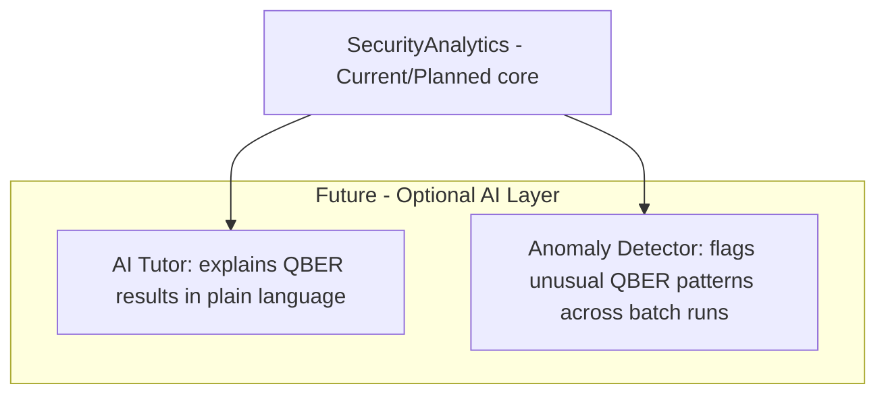

# 08 — AI Architecture

**Version:** 0.1.0 | **Last Updated:** 2026-07-22 | **Author:** ParaDise
**Status:** Future Design (no AI component exists or is required for core functionality) | **References:** `07_SYSTEM_ARCHITECTURE.md`

---

## Table of Contents
1. [Current State](#1-current-state)
2. [Why AI Is Not Core to the Product](#2-why-ai-is-not-core-to-the-product)
3. [Future AI Architecture (Design)](#3-future-ai-architecture-design)
4. [Assumptions](#4-assumptions)
5. [Scope](#5-scope)
6. [References](#6-references)

---

## 1. Current State

**No AI/ML component exists in QST, and none is required for the core BB84 simulation, attack modeling, or analytics functionality.** BB84 is a deterministic-given-randomness physical protocol; its correctness does not depend on machine learning.

## 2. Why AI Is Not Core to the Product

QST's core value (per `02_PRODUCT_BLUEPRINT.md`) is a correct, transparent, inspectable simulation of a quantum protocol. Introducing AI/ML into the core simulation path would reduce transparency (a core principle in `00_PROJECT_CONSTITUTION.md`) without a clear benefit. AI is therefore scoped only to **optional, clearly-separated Future features**, never to the protocol engine itself.

## 3. Future AI Architecture (Design)

The following are **Future, not Planned-for-near-term-roadmap** — explicitly lower priority than the core toolkit (see `15_ROADMAP.md`).

- **AI Tutor (Future):** An optional integration (e.g., via an LLM API) that takes simulation results (QBER, key rate) and generates a natural-language explanation for Educational Mode users. Explicitly optional and disabled by default, so the toolkit has zero hard AI dependency.
- **Anomaly Detector (Future):** A statistical/ML model to flag unusual QBER distributions across large batch/research-mode runs — useful only at a research scale most users won't reach initially.

Both are explicitly out of scope for v1.0 (see `19_RELEASE_PLAN.md`).

## 4. Assumptions

- Any future AI feature will be opt-in and will never be required to run a core BB84 simulation.

## 5. Scope

This document exists to satisfy documentation-suite completeness and to explicitly record that AI is *not* part of the current or near-term architecture — not to describe an implemented system.

## 6. References

- `00_PROJECT_CONSTITUTION.md`
- `02_PRODUCT_BLUEPRINT.md`
- `20_FUTURE_ENHANCEMENTS.md`

---

## Implementation Status

| Component | Status |
|---|---|
| AI Tutor | Future |
| Anomaly Detector | Future |
| Any AI in core protocol logic | Not planned (explicitly out of scope) |

## Future Improvements

- Revisit AI Tutor feasibility once Educational Mode (core, non-AI) ships and user feedback indicates demand.
