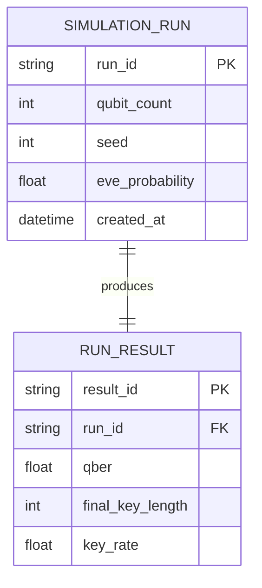

# 09 — Database Design

**Version:** 0.1.0 | **Last Updated:** 2026-07-22 | **Author:** ParaDise
**Status:** Future Design (no database exists; core toolkit is file/stateless) | **References:** `07_SYSTEM_ARCHITECTURE.md`

---

## Table of Contents
1. [Current State](#1-current-state)
2. [Why No Database Is Needed for Core Functionality](#2-why-no-database-is-needed-for-core-functionality)
3. [Future State: Research Result Store](#3-future-state-research-result-store)
4. [Assumptions](#4-assumptions)
5. [Scope](#5-scope)
6. [References](#6-references)

---

## 1. Current State

**No database exists.** QST's core functionality (single or batch BB84 simulation runs) is stateless: inputs are parameters (qubit count, seed, Eve probability), outputs are in-memory results optionally exported to CSV/JSON (per `05_PRODUCT_REQUIREMENTS.md` FR-9). No persistent storage is required for v1.0.

## 2. Why No Database Is Needed for Core Functionality

- Simulation runs are independent and reproducible from parameters + seed — there's no need to persist state between runs for correctness.
- File-based export (CSV/JSON) is sufficient for research-mode users who want to analyze results externally (e.g., in pandas, R, or Excel).
- Introducing a database dependency would raise the barrier to entry for students running the toolkit locally — directly against the "education first, accessible" principle in `00_PROJECT_CONSTITUTION.md`.

## 3. Future State: Research Result Store

If a **Future** web/dashboard interface is built (see `12_UI_UX_DESIGN.md`, `20_FUTURE_ENHANCEMENTS.md`) to let users browse historical batch-run results across sessions, a lightweight embedded database (e.g., SQLite) would be the natural choice — no server dependency, consistent with the accessibility principle.

### Proposed Future ER Diagram (SQLite, Future only)

This schema is **Future** and unimplemented — it exists here only as a forward-looking design, not a current feature.

## 4. Assumptions

- If persistence is ever added, it will be optional and additive, never a hard requirement to run a basic simulation.

## 5. Scope

Covers data persistence only. In-memory data structures used during a simulation run are covered in `07_SYSTEM_ARCHITECTURE.md`.

## 6. References

- `07_SYSTEM_ARCHITECTURE.md`
- `20_FUTURE_ENHANCEMENTS.md`

---

## Implementation Status

| Item | Status |
|---|---|
| Database of any kind | Not implemented, not planned for v1.0 |
| SQLite result store | Future |

## Future Improvements

- Revisit only if/when a multi-session web dashboard (Future feature) is prioritized.
