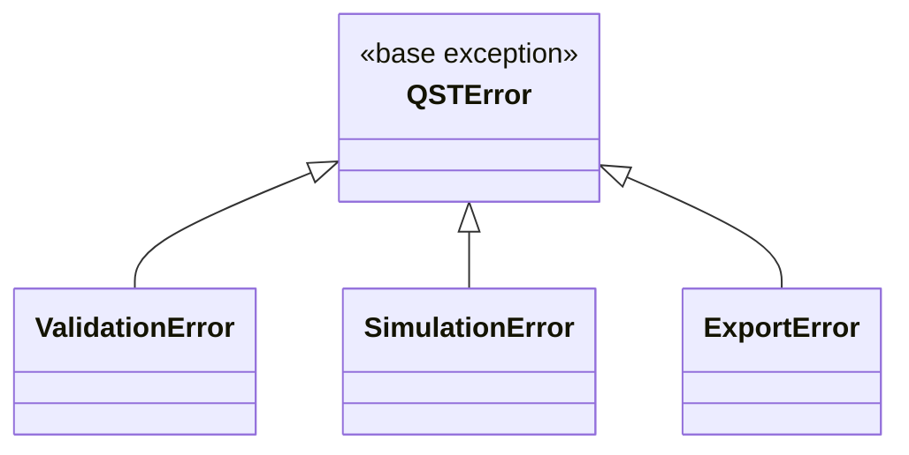

# 10 — API Specification

**Version:** 0.2.0 | **Last Updated:** 2026-07-22 | **Author:** ParaDise
**Status:** Design (Pre-Development — describes the planned Python API, not an implemented one) | **References:** `07_SYSTEM_ARCHITECTURE.md`

---

## Table of Contents
1. [Scope of "API" for This Project](#1-scope-of-api-for-this-project)
2. [Current APIs](#2-current-apis)
3. [Planned Python Library API](#3-planned-python-library-api)
4. [Planned CLI Interface](#4-planned-cli-interface)
5. [Return Objects](#5-return-objects)
6. [Error Codes & Exceptions](#6-error-codes--exceptions)
7. [Error Handling (General)](#7-error-handling-general)
8. [API Versioning Policy](#8-api-versioning-policy)
9. [API Stability Policy](#9-api-stability-policy)
10. [Deprecation Policy](#10-deprecation-policy)
11. [Future Web/REST API](#11-future-webrest-api)
12. [Assumptions](#12-assumptions)
13. [Scope Note](#13-scope-note)
14. [References](#14-references)

---

## 1. Scope of "API" for This Project

QST's primary interface is a **Python library API**, not a network service — consistent with its use as an educational/research toolkit run locally or in notebooks. A CLI wraps the library for convenience. A REST API is a **Future** possibility only if a hosted demo/dashboard is built.

## 2. Current APIs

**None.** No code exists (see `01_REPOSITORY_AUDIT.md`).

## 3. Planned Python Library API

```python
from qst.orchestration import SimulationOrchestrator

orchestrator = SimulationOrchestrator(
    n_qubits=1000,
    seed=42,
    eve_intercept_probability=0.0,  # 0.0 = no eavesdropper
)

result = orchestrator.run()

# result (planned shape):
# result.qber -> float
# result.final_key_length -> int
# result.key_rate -> float
# result.sifted_key -> list[int]
```

**Request/response equivalent (function signature contract):**

| Parameter | Type | Required | Notes |
|---|---|---|---|
| `n_qubits` | int | Yes | Number of qubits to simulate |
| `seed` | int | No | For reproducibility; random if omitted |
| `eve_intercept_probability` | float (0.0–1.0) | No | Default 0.0 (no eavesdropper) |

| Result field | Type | Notes |
|---|---|---|
| `qber` | float | Quantum Bit Error Rate estimated from sample |
| `final_key_length` | int | Length of final sifted, error-checked key |
| `key_rate` | float | Fraction of raw qubits yielding final key bits |
| `sifted_key` | list[int] | The resulting shared key bits |

## 4. Planned CLI Interface

```bash
qst simulate --qubits 1000 --seed 42 --eve-prob 0.0 --output results.json
```

| Flag | Purpose |
|---|---|
| `--qubits` | Number of qubits to simulate |
| `--seed` | Random seed |
| `--eve-prob` | Eavesdropper interception probability |
| `--output` | Export path (CSV/JSON) |

## 5. Return Objects

> **Status: Planned.** The following defines the intended shape of `SimulationResult`, the single canonical return type for both the library API and (serialized) CLI/export output.

```python
@dataclass
class SimulationResult:
    qber: float
    final_key_length: int
    key_rate: float
    sifted_key: list[int]
    n_qubits: int
    seed: int
    eve_intercept_probability: float
    warnings: list[str]           # e.g., "empty key" edge case (see 05_PRODUCT_REQUIREMENTS.md EC-5)
    metadata: dict                # backend version, simulation duration, etc.
```

- `warnings` is always present (possibly empty) rather than raising an exception for statistically valid but unusual outcomes (e.g., zero sifted bits) — this keeps error handling reserved for genuinely invalid states (see §6).
- `metadata` is intentionally an open dict rather than a fixed schema, so it can absorb new diagnostic fields (e.g., simulation duration for NFR-1 benchmarking) without breaking the public dataclass contract — this is the API's designated extension point for non-breaking additions (see §9).

## 6. Error Codes & Exceptions

> **Status: Planned.** Exception hierarchy to be implemented in `qst.exceptions`.



| Exception | Raised When | Inherits From |
|---|---|---|
| `QSTError` | Base class for all QST-specific exceptions — never raised directly | `Exception` |
| `ValidationError` | Invalid input parameters (e.g., `n_qubits <= 0`, probability outside [0,1]) — see `05_PRODUCT_REQUIREMENTS.md` §7 | `QSTError` |
| `SimulationError` | Underlying Qiskit/Aer backend failure during a run | `QSTError` |
| `ExportError` | CSV/JSON export failure (e.g., disk full, permission denied) | `QSTError` |

All QST-specific exceptions carry a `.code` string attribute (e.g., `"QST-VAL-001"`) for programmatic matching in addition to the human-readable message — exact code registry **To Be Implemented** alongside the exception classes themselves.

## 7. Error Handling (General)

**Planned** conventions (no code exists to verify against yet):

- Invalid parameter ranges (e.g., negative qubit count, probability outside [0,1]) raise `ValidationError` with a descriptive message.
- Qiskit/backend errors are caught and re-raised as `SimulationError` to avoid leaking backend implementation details through the public API, with the original exception preserved via `__cause__` for debugging (see `07_SYSTEM_ARCHITECTURE.md` §11 Failure Recovery).

## 8. API Versioning Policy

**Planned** (not yet in force — no releases exist):

- The public Python API (`SimulationOrchestrator`, `SimulationResult`, exception classes exported from `qst.exceptions`) follows Semantic Versioning at the package level (see `06_TECHNICAL_REQUIREMENTS.md` §9, `19_RELEASE_PLAN.md`).
- Anything not explicitly documented in this specification (internal module contents, private methods prefixed `_`) is not part of the public API and may change in any release without a major version bump.

## 9. API Stability Policy

| API Surface | Stability Commitment (Planned, from v1.0) |
|---|---|
| `SimulationOrchestrator` public methods | Stable — breaking changes require a major version bump |
| `SimulationResult` fields | Additive changes (new fields) are minor-version-safe; field removal/type change is a major-version breaking change |
| `metadata` dict contents | Explicitly unstable/open — may gain new keys in any release (see §5) |
| CLI flags | Stable once introduced; new flags may be added in minor releases |
| Exception hierarchy (§6) | Stable — new exception subclasses may be added (minor version), existing ones will not be removed without a major version bump |

## 10. Deprecation Policy

**Planned:**

1. A deprecated API element is marked with a `DeprecationWarning` at call time and documented as deprecated in the relevant `docs/` file and CHANGELOG.
2. Deprecated elements remain functional for at least one full minor version cycle before removal.
3. Removal happens only in a major version release, per §8/§9.

## 11. Future Web/REST API

Not designed in detail — flagged only as a possibility if a hosted demo is built (see `20_FUTURE_ENHANCEMENTS.md`). No endpoints, auth model, or schema exist yet.

## 12. Assumptions

- The Python library API is the primary, stable contract; the CLI is a thin wrapper over it.
- Exception `.code` values, once defined, will not be reused for a different error condition across versions, to keep programmatic error handling reliable for downstream users.

## 13. Scope Note

This document does not describe authentication, since there is no networked service in the current or near-term roadmap.

## 14. References

- `07_SYSTEM_ARCHITECTURE.md`
- `05_PRODUCT_REQUIREMENTS.md`
- `19_RELEASE_PLAN.md`
- `20_FUTURE_ENHANCEMENTS.md`

---

## Implementation Status

| Item | Status |
|---|---|
| Python library API | Planned |
| CLI | Planned |
| `SimulationResult` dataclass | Planned |
| Exception hierarchy | Planned |
| Versioning/stability/deprecation policies | Planned (not yet in force) |
| REST API | Future |

## Future Improvements

- Design a REST API only if/when a hosted dashboard becomes a prioritized feature.
- Define the full exception `.code` registry once the exception hierarchy is implemented.

## Document Improvements

This revision (0.2.0) added: a fully specified Return Object (`SimulationResult`, §5), an Error Codes & Exceptions hierarchy (§6), and explicit API Versioning (§8), Stability (§9), and Deprecation (§10) policies. All original content (Scope, Current APIs, Planned Library API, CLI, general Error Handling, Future Web/REST API, Assumptions, Scope Note, References) is preserved unchanged.
