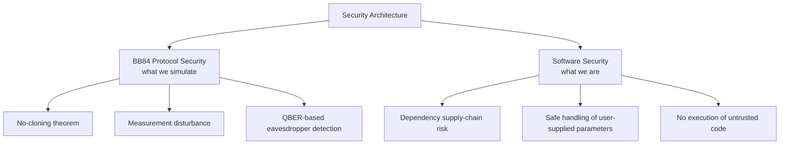
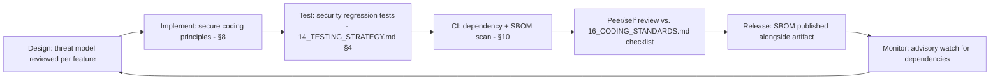

# 11 — Security Architecture

**Version:** 0.2.0 | **Last Updated:** 2026-07-22 | **Author:** ParaDise
**Status:** Design (Pre-Development) | **References:** `07_SYSTEM_ARCHITECTURE.md`, `00_PROJECT_CONSTITUTION.md`

---

## Table of Contents
1. [Purpose](#1-purpose)
2. [Two Distinct Security Contexts](#2-two-distinct-security-contexts)
3. [Threat Model: BB84 Protocol Being Simulated](#3-threat-model-bb84-protocol-being-simulated)
4. [BB84 Security Properties (What the Simulation Must Correctly Demonstrate)](#4-bb84-security-properties)
5. [Threat Model: The Software Itself](#5-threat-model-the-software-itself)
6. [STRIDE Analysis](#6-stride-analysis)
7. [MITRE ATT&CK Mapping](#7-mitre-attck-mapping)
8. [Secure Coding Principles for QST](#8-secure-coding-principles-for-qst)
9. [Secure SDLC](#9-secure-sdlc)
10. [Supply Chain Security & SBOM Strategy](#10-supply-chain-security--sbom-strategy)
11. [Responsible Disclosure Workflow](#11-responsible-disclosure-workflow)
12. [Cryptographic Design Notes](#12-cryptographic-design-notes)
13. [Future Hardening](#13-future-hardening)
14. [Assumptions](#14-assumptions)
15. [Scope](#15-scope)
16. [References](#16-references)
17. [Glossary](#17-glossary)

---

## 1. Purpose

QST has an unusual dual security surface: it is software that **simulates** a security protocol. This document separates two distinct concerns that must not be conflated:

1. **The security properties of BB84 itself**, which the simulation must model correctly.
2. **The security of the QST codebase itself**, as a piece of software (dependency risk, code execution risk, etc.).

## 2. Two Distinct Security Contexts

## 3. Threat Model: BB84 Protocol Being Simulated

| Actor | Capability Modeled | Currently Simulated? |
|---|---|---|
| Eve (passive eavesdropper) | Intercepts qubits, measures, resends | Planned (FR-5) |
| Eve (active/other attacks — e.g., PNS on real hardware) | Beyond intercept-resend | Future — out of scope for v1.0 |
| Malicious classical channel actor | Tampering with sifting/reconciliation messages | Future — not modeled; BB84's classical channel is assumed authenticated per standard protocol assumptions |

## 4. BB84 Security Properties (What the Simulation Must Correctly Demonstrate)

- **No-cloning theorem:** Eve cannot perfectly copy an unknown quantum state, so any interception introduces detectable disturbance. The simulation's intercept-resend model (FR-5) must reflect this by introducing measurable QBER increase, not a "free" copy.
- **Measurement disturbance:** Measuring a qubit in the wrong basis disturbs its state with 50% probability, which is the mathematical source of the ~25% expected QBER under full interception (see `05_PRODUCT_REQUIREMENTS.md` acceptance criteria).
- **Eavesdropper detectability via QBER:** The core pedagogical claim of the toolkit is that eavesdropping is statistically detectable. Test cases in `14_TESTING_STRATEGY.md` must verify this holds across the implementation, not just in theory.

> **Critical implementation note:** Any future contributor modifying the Eavesdropper model (`EVE` in `07_SYSTEM_ARCHITECTURE.md`) must re-verify these acceptance criteria — an implementation bug that makes eavesdropping *not* raise QBER would silently invalidate the entire pedagogical point of the toolkit.

## 5. Threat Model: The Software Itself

| Threat | Relevance to QST | Mitigation (Planned) |
|---|---|---|
| Dependency supply-chain compromise (e.g., compromised PyPI package) | Real — QST depends on Qiskit and its transitive dependencies | Pin dependency versions; monitor advisories (see `17_RISK_REGISTER.md`, §10 below) |
| Unsafe deserialization of exported/imported result files | Possible if JSON/CSV import is added carelessly | Use safe parsers only (e.g., `json.loads`, never `eval`/`pickle` on untrusted input) |
| Arbitrary code execution via CLI parameter injection | Low risk (parameters are numeric) but must be validated | Strict type/range validation on all CLI/API inputs |
| Malicious contributions (PRs) | Low risk at current single-maintainer stage | Code review before merge (see `16_CODING_STANDARDS.md`) |

## 6. STRIDE Analysis

> Applied to QST-as-software (not to the simulated BB84 protocol, which has its own model in §3–4).

| STRIDE Category | Applicable Threat | Mitigation |
|---|---|---|
| **S**poofing | Not applicable — no authentication surface exists (local library/CLI, no user accounts) | N/A for v1.0 |
| **T**ampering | A malicious or compromised dependency altering simulation output | Dependency pinning, SBOM (§10), `pip-audit` in CI |
| **R**epudiation | Not applicable — no multi-user audit trail requirement for a local educational tool | N/A for v1.0 |
| **I**nformation Disclosure | Exported CSV/JSON files could inadvertently include more than intended (e.g., full sifted key exposed in a shared research dataset) | Document clearly in export function docstrings and `10_API_SPECIFICATION.md` that exported keys are simulation artifacts, not secrets to be protected — but avoid unnecessary verbosity in default export fields |
| **D**enial of Service | Extremely large `n_qubits` causing memory exhaustion (see `05_PRODUCT_REQUIREMENTS.md` EC-6) | Input validation with sane upper bounds; graceful `ValidationError` rather than an unhandled crash |
| **E**levation of Privilege | Not applicable — QST requires no elevated OS privileges to run | N/A for v1.0 |

## 7. MITRE ATT&CK Mapping

> QST is an educational/research simulator, not a network-facing production system, so most enterprise ATT&CK techniques (lateral movement, credential access, etc.) are **not applicable**. The mapping below is scoped to the techniques genuinely relevant to a locally-run Python package with dependency risk.

| ATT&CK Technique (ID) | Relevance to QST |
|---|---|
| T1195 — Supply Chain Compromise | Relevant — mitigated via dependency pinning and SBOM/vulnerability scanning (§10) |
| T1059 — Command and Scripting Interpreter | Relevant only in the sense that QST *is* a Python script users run; no attacker-controlled scripting surface exists within QST itself |
| T1499 — Endpoint Denial of Service | Relevant at small scale — see STRIDE "Denial of Service" row above (resource exhaustion via oversized `n_qubits`) |
| Most other enterprise techniques (lateral movement, C2, exfiltration, credential access) | **Not applicable** — QST has no network component, no credentials, and no multi-host footprint in its current or near-term architecture |

This mapping should be revisited if any Future networked feature (web dashboard, AI Tutor API calls) is added, since those would introduce a meaningfully different attack surface.

## 8. Secure Coding Principles for QST

- Never use `eval`, `exec`, or `pickle.load` on any user- or file-supplied data.
- Validate all numeric inputs (qubit count, probabilities, seeds) at API boundaries before passing into simulation logic.
- Pin and periodically audit dependencies (Qiskit and transitive deps) for known CVEs.
- Keep the simulation core free of any network calls, so running QST locally carries no data-exfiltration risk by design.

## 9. Secure SDLC

**Planned** lifecycle integration (no SDLC has been executed yet — pre-development):

Every feature touching `core/` (BB84Protocol, Eavesdropper) or `analytics/` must be checked against §4's acceptance criteria before merge, per `00_PROJECT_CONSTITUTION.md` §8 Definition of Done.

## 10. Supply Chain Security & SBOM Strategy

**Planned:**

- A Software Bill of Materials (SBOM), in CycloneDX or SPDX format, will be generated at build/release time (e.g., via `cyclonedx-py` or equivalent tooling) once CI/CD exists (`13_DEPLOYMENT.md`).
- `pip-audit` (or equivalent) runs in CI on every PR and on a scheduled basis against `main`, to catch newly disclosed CVEs in already-released QST versions.
- Dependency versions are pinned (not just floor-bounded) in released artifacts to ensure reproducible, auditable builds (see `06_TECHNICAL_REQUIREMENTS.md` §8 Version Support Policy).
- The SBOM is published alongside each PyPI release as a release asset, so downstream users (e.g., a university IT department vetting the toolkit) can audit QST's dependency tree without installing it first.

## 11. Responsible Disclosure Workflow

**Planned** (no vulnerabilities have been reported — no code exists yet):

1. A `SECURITY.md` file will be added at repository root once the repo is scaffolded, specifying a private contact channel (e.g., a dedicated email or GitHub Security Advisory) for reporting suspected vulnerabilities.
2. Reports are acknowledged within a stated target window (exact SLA **To Be Implemented** — reasonable for a solo-maintainer project, e.g., best-effort within 7 days).
3. Confirmed vulnerabilities are fixed and disclosed via a GitHub Security Advisory with credit to the reporter (unless they request anonymity), following coordinated disclosure norms.
4. Given QST's nature (no user data, no network service — see §6 STRIDE), realistic vulnerability classes are expected to be dependency-related (§10) or resource-exhaustion (§6 DoS row) rather than data breaches.

## 12. Cryptographic Design Notes

QST simulates BB84's **key agreement** step only. It intentionally does **not** implement:

- Privacy amplification (Future — would be needed for a "real" deployable QKD key, out of scope for the educational-simulation goal of v1.0).
- Authentication of the classical channel (assumed/abstracted away, as is standard in introductory BB84 treatments).

This is a deliberate scoping decision, not an oversight: the goal is teaching the core quantum mechanism, not producing a production-grade QKD stack. This must be stated clearly in user-facing documentation so learners don't mistake QST for a deployable security product.

## 13. Future Hardening

- Add privacy amplification simulation for a more complete protocol picture (Future).
- Add authenticated classical channel simulation, showing what happens if that assumption is violated (Future).
- Formal dependency-scanning CI step (e.g., `pip-audit`) once CI exists (Planned, tied to `13_DEPLOYMENT.md` — also see §10).
- Revisit STRIDE/ATT&CK mappings (§6, §7) if any networked feature is added.

## 14. Assumptions

- QST is explicitly an educational/research simulator, not a production key-distribution system — this framing bounds the entire threat model.
- The responsible disclosure SLA (§11) is a placeholder reflecting solo-maintainer capacity and should be revisited if the contributor base grows.

## 15. Scope

Covers both the simulated protocol's security properties and the codebase's own security posture. Does not cover deployment-environment hardening beyond what's noted in `13_DEPLOYMENT.md`.

## 16. References

- `07_SYSTEM_ARCHITECTURE.md`
- `05_PRODUCT_REQUIREMENTS.md`
- `17_RISK_REGISTER.md`
- `13_DEPLOYMENT.md`
- `16_CODING_STANDARDS.md`
- `29_THREAT_MODEL.md` — dedicated threat-modeling artifacts (assets, actors, trust boundaries, attack trees, misuse cases) companion to this document's STRIDE/ATT&CK/SDLC/SBOM coverage; §6's STRIDE table here is the single source of truth `29_THREAT_MODEL.md` references rather than duplicates
- `22_MATHEMATICAL_FOUNDATION.md` §13, §19 — mathematical basis for the no-cloning-theorem argument underlying §4's security properties

## 17. Glossary

| Term | Definition |
|---|---|
| No-cloning theorem | A fundamental quantum mechanics result stating an unknown quantum state cannot be copied exactly. |
| Privacy amplification | A classical post-processing step in real QKD systems that reduces a partially-known key to a shorter, fully-secret one. |
| STRIDE | A threat-modeling mnemonic: Spoofing, Tampering, Repudiation, Information Disclosure, Denial of Service, Elevation of Privilege. |
| SBOM | Software Bill of Materials — a machine-readable inventory of a software artifact's components and dependencies. |

---

## Implementation Status

| Item | Status |
|---|---|
| Intercept-resend eavesdropper model | Planned |
| Dependency pinning / CVE monitoring | Planned |
| STRIDE analysis (§6) | Current (analysis performed at design stage) |
| MITRE ATT&CK mapping (§7) | Current (analysis performed at design stage) |
| SBOM generation | Planned |
| `SECURITY.md` / disclosure workflow | Planned |
| Privacy amplification | Future |
| Authenticated classical channel simulation | Future |

## Future Improvements

- Add a documented threat model revision cadence (e.g., re-review each major release).
- Automate SBOM generation and publication as part of the CI/CD release pipeline (`13_DEPLOYMENT.md`).

## Document Improvements

This revision (0.2.0) added: a STRIDE Analysis (§6), a MITRE ATT&CK Mapping scoped to relevance (§7), a Secure SDLC lifecycle diagram (§9), a Supply Chain Security & SBOM Strategy (§10), and a Responsible Disclosure Workflow (§11). All original content (Purpose, Security Contexts, BB84 Threat Model, BB84 Security Properties, Software Threat Model, Secure Coding Principles, Cryptographic Design Notes, Future Hardening, Assumptions, Scope, References, Glossary) is preserved unchanged.
