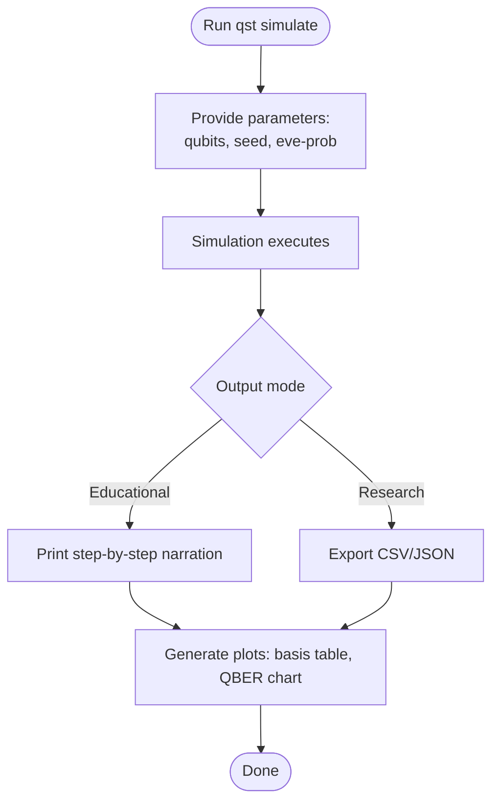

# 12 — UI/UX Design

**Version:** 0.1.0 | **Last Updated:** 2026-07-22 | **Author:** ParaDise
**Status:** Design (Pre-Development) | **References:** `02_PRODUCT_BLUEPRINT.md`

---

## Table of Contents
1. [Application Flow](#1-application-flow)
2. [User Personas](#2-user-personas)
3. [Navigation (CLI-first)](#3-navigation-cli-first)
4. [Accessibility](#4-accessibility)
5. [Design Principles](#5-design-principles)
6. [Future UI Improvements](#6-future-ui-improvements)
7. [Assumptions](#7-assumptions)
8. [Scope](#8-scope)
9. [References](#9-references)

---

## 1. Application Flow

For v1.0, the "UI" is CLI + generated static plots/tables (per `10_API_SPECIFICATION.md` §4) rather than a graphical application — appropriate for a library-first toolkit.

## 2. User Personas

| Persona | Goal | Primary Mode |
|---|---|---|
| "Ananya, undergrad" | Understand BB84 for an exam/lab | Educational Mode |
| "Dr. Verma, researcher" | Run 1,000 batch simulations varying Eve's probability | Research Mode |
| "Rahul, security engineer" | Get an intuitive feel for QKD before a conference talk | Educational Mode |

## 3. Navigation (CLI-first)

- `qst simulate` — run a single simulation.
- `qst batch` — run parameter-sweep batch simulations (Planned).
- `qst --help` — full command reference (Planned, auto-generated via `argparse`/`click`).

**Future:** a lightweight web dashboard (e.g., Streamlit) is a plausible Future addition for users who prefer a GUI over CLI — not committed to the roadmap yet (see `20_FUTURE_ENHANCEMENTS.md`).

## 4. Accessibility

- CLI output must not rely on color alone to convey meaning (e.g., pass/fail should also use text labels, not just green/red), so it remains usable for colorblind users and in non-color terminals.
- Generated plots should include descriptive titles/axis labels sufficient to be understood if exported as static images for course materials (alt-text friendly).

## 5. Design Principles

- **Progressive disclosure:** Educational Mode shows one concept at a time (bit generation → basis choice → measurement → sifting → QBER), rather than a wall of output.
- **Reproducible by default:** Every run should be able to show/reuse its seed so results can be shared and reproduced exactly.
- **No hidden magic:** Every number shown (QBER, key rate) should be traceable to an underlying formula documented in `11_SECURITY_ARCHITECTURE.md`, so the tool never feels like a black box — this is core to the educational mission.

## 6. Future UI Improvements

- Web dashboard (Streamlit/similar) for point-and-click parameter exploration.
- Interactive Bloch-sphere visualizations (e.g., via `qiskit.visualization` widgets in Jupyter).
- Guided "lab exercise" mode with quiz checkpoints for classroom use.

## 7. Assumptions

- The primary initial audience (students, researchers) is comfortable with a CLI/notebook workflow; a GUI is a nice-to-have, not a blocker for adoption.

## 8. Scope

Covers user-facing interaction design only, not internal module architecture (`07_SYSTEM_ARCHITECTURE.md`).

## 9. References

- `02_PRODUCT_BLUEPRINT.md`
- `10_API_SPECIFICATION.md`
- `20_FUTURE_ENHANCEMENTS.md`

---

## Implementation Status

| Item | Status |
|---|---|
| CLI | Planned |
| Educational Mode narration | Planned |
| Static plots | Planned |
| Web dashboard | Future |

## Future Improvements

- See §6 above.
