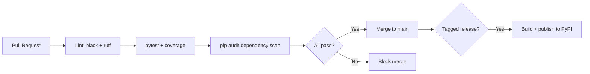

# 13 — Deployment

**Version:** 0.1.0 | **Last Updated:** 2026-07-22 | **Author:** ParaDise
**Status:** Design (Pre-Development — no CI/CD or packaging exists yet) | **References:** `06_TECHNICAL_REQUIREMENTS.md`

---

## Table of Contents
1. [Local Development Setup](#1-local-development-setup)
2. [Production/Distribution Model](#2-productiondistribution-model)
3. [Docker](#3-docker)
4. [CI/CD](#4-cicd)
5. [Environment Variables](#5-environment-variables)
6. [Release Process](#6-release-process)
7. [Assumptions](#7-assumptions)
8. [Scope](#8-scope)
9. [References](#9-references)

---

## 1. Local Development Setup

**Planned** (no repository exists to install yet):

```bash
git clone <repo-url>
cd quantum-security-toolkit
python -m venv .venv
source .venv/bin/activate
pip install -e ".[dev]"
pytest
```

## 2. Production/Distribution Model

As a Python library/CLI toolkit (not a hosted service), "production" means **PyPI distribution**:

- Planned: `pip install quantum-security-toolkit` once published.
- No server-side production environment is required for v1.0 (no hosted service exists — see `09_DATABASE_DESIGN.md`, `10_API_SPECIFICATION.md`).

## 3. Docker

**Planned (optional convenience, not required to run the toolkit):**

```dockerfile
# Planned Dockerfile — illustrative, not yet created/tested
FROM python:3.11-slim
WORKDIR /app
COPY . .
RUN pip install -e .
ENTRYPOINT ["qst"]
```

A container is useful for reproducible CI runs and for users who prefer not to manage a local Python environment, but is not on the critical path for v1.0.

## 4. CI/CD

**Planned** (no pipeline exists yet):



Recommended platform: GitHub Actions, given GitHub is assumed as the hosting platform (see `01_REPOSITORY_AUDIT.md` assumptions).

## 5. Environment Variables

None required for core functionality (no network calls, no secrets — see `11_SECURITY_ARCHITECTURE.md` §6). If a Future AI Tutor feature (`08_AI_ARCHITECTURE.md`) is built, it would require an API key environment variable at that time — not applicable currently.

## 6. Release Process

**Planned**, aligned with `19_RELEASE_PLAN.md`:

1. Merge feature work to `main` via reviewed PRs.
2. Update CHANGELOG (mechanism TBD).
3. Tag a semantic version (`vX.Y.Z`).
4. CI builds and publishes to PyPI on tag push.

## 7. Assumptions

- GitHub is the assumed source control and CI host; no alternative has been evaluated (see `18_DECISION_LOG.md` if this changes).

## 8. Scope

Covers build/release/deployment mechanics. Does not cover architecture (`07_SYSTEM_ARCHITECTURE.md`) or testing methodology (`14_TESTING_STRATEGY.md`).

## 9. References

- `06_TECHNICAL_REQUIREMENTS.md`
- `14_TESTING_STRATEGY.md`
- `19_RELEASE_PLAN.md`

---

## Implementation Status

| Item | Status |
|---|---|
| Local dev setup | Planned |
| PyPI packaging | Planned |
| Dockerfile | Planned |
| CI/CD pipeline | Planned |

## Future Improvements

- Add automated Docker Hub image publishing once Docker support is validated.
