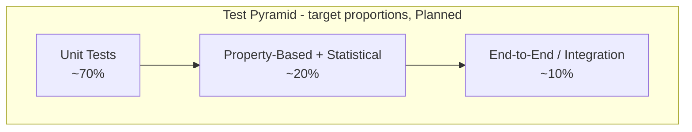

# 14 — Testing Strategy

**Version:** 0.2.0 | **Last Updated:** 2026-07-22 | **Author:** ParaDise
**Status:** Design (Pre-Development — no tests exist yet) | **References:** `05_PRODUCT_REQUIREMENTS.md`, `11_SECURITY_ARCHITECTURE.md`

---

## Table of Contents
1. [Testing Philosophy](#1-testing-philosophy)
2. [Test Pyramid](#2-test-pyramid)
3. [Unit Testing](#3-unit-testing)
4. [Integration Testing](#4-integration-testing)
5. [Property-Based Testing](#5-property-based-testing)
6. [Mutation Testing](#6-mutation-testing)
7. [Fuzz Testing](#7-fuzz-testing)
8. [Golden Dataset](#8-golden-dataset)
9. [Statistical Validation Strategy](#9-statistical-validation-strategy)
10. [Security Testing](#10-security-testing)
11. [Performance Testing](#11-performance-testing)
12. [Coverage Goals](#12-coverage-goals)
13. [Assumptions](#13-assumptions)
14. [Scope](#14-scope)
15. [References](#15-references)

---

## 1. Testing Philosophy

Because QST's entire value proposition rests on *correctly* demonstrating a security property (eavesdropper detection via QBER — see `11_SECURITY_ARCHITECTURE.md` §4), testing here is not just about avoiding crashes — it must **prove the protocol's security claim holds in the implementation**, with statistical rigor, every time the core logic changes.

## 2. Test Pyramid

| Layer | Purpose | Tooling |
|---|---|---|
| Unit (≈70%) | Fast, isolated checks of individual functions (`sift()`, `compute_qber()`, etc.) | `pytest` |
| Property-Based/Statistical (≈20%) | Verify invariants hold across a *range* of random inputs/seeds, not just fixed examples | `hypothesis` (Planned, §5) |
| Integration/E2E (≈10%) | Full `SimulationOrchestrator.run()` calls verifying end-to-end contract | `pytest` (integration marker) |

The pyramid is intentionally unit-heavy for speed, with the statistical layer weighted more heavily than a typical software project because QST's core claim (§9) is inherently probabilistic and cannot be fully verified by example-based unit tests alone.

## 3. Unit Testing

**Planned**, using `pytest`. Minimum required unit tests before Phase 1 is "Done" (per `00_PROJECT_CONSTITUTION.md` §8):

| Test | Verifies |
|---|---|
| `test_bit_basis_generation_length` | Generated bits/bases match requested qubit count |
| `test_reproducibility_with_seed` | Same seed → identical results across runs |
| `test_sifting_discards_mismatched_bases` | Sifting logic correctness |
| `test_qber_zero_eve` | QBER near simulator noise floor when Eve absent |
| `test_qber_full_eve` | QBER approaches theoretical ~25% when Eve intercepts 100% |
| `test_invalid_parameter_validation` | Out-of-range inputs raise `ValidationError` (see `10_API_SPECIFICATION.md` §6) |

## 4. Integration Testing

**Planned:** end-to-end test running a full `SimulationOrchestrator.run()` call and validating the shape/consistency of the returned result object against the API contract in `10_API_SPECIFICATION.md` §5 (`SimulationResult`).

## 5. Property-Based Testing

**Planned**, using `hypothesis`, to complement fixed-example unit tests with generated-input invariant checks:

| Property | Invariant to Check |
|---|---|
| Key length monotonicity | `final_key_length <= n_qubits` for all valid `n_qubits` |
| QBER bounds | `0.0 <= qber <= 1.0` for all valid inputs |
| Reproducibility | For any valid `(n_qubits, seed, eve_prob)` tuple, two runs with the same inputs always produce identical `SimulationResult` |
| Monotonic QBER trend | As `eve_intercept_probability` increases from 0 to 1 (sampled at intervals), mean QBER across repeated trials should not decrease — statistically checked, not exact per `09` Statistical Validation Strategy |

This directly supports `05_PRODUCT_REQUIREMENTS.md` §6 Edge Cases by fuzzing across the parameter space rather than only testing hand-picked edge values.

## 6. Mutation Testing

**Planned (Phase 3 or later)** — not required for Phase 1 exit criteria, but recommended once core coverage targets (§12) are met, to validate that tests actually fail when core logic is subtly broken:

- Tooling candidate: `mutmut` or `cosmic-ray`.
- Priority target: `core/` (BB84Protocol, Eavesdropper) and `analytics/` (SecurityAnalytics) — the modules where a silently-surviving mutant would be most dangerous, per `11_SECURITY_ARCHITECTURE.md` §4's "critical implementation note."
- Target mutation score: **To Be Set** once a baseline run is performed; introducing an arbitrary target before any data exists would not be a grounded claim.

## 7. Fuzz Testing

**Planned:** targeted fuzzing of the CLI/API input-validation boundary (`10_API_SPECIFICATION.md` §6, §7) using malformed/extreme inputs (huge integers, negative floats, NaN, non-numeric strings coerced incorrectly) to confirm every invalid input path raises `ValidationError` cleanly rather than an unhandled exception. This is distinct from Property-Based Testing (§5), which fuzzes *valid* input ranges for invariants — fuzz testing here specifically targets *invalid* and adversarial input handling (see `11_SECURITY_ARCHITECTURE.md` §6 STRIDE "Denial of Service" row).

## 8. Golden Dataset

**Planned:** a small, fixed set of `(n_qubits, seed, eve_intercept_probability)` input tuples with their expected `SimulationResult` output, checked into `tests/golden/` once the repository exists. Purpose:

- Acts as a regression guard: if a future refactor of `BB84Protocol` or `Eavesdropper` accidentally changes output for a fixed seed, the golden test fails immediately, even if all other unit tests still pass.
- Golden values must be generated from a known-correct Phase 1 implementation and reviewed manually before being locked in — they are not fabricated ahead of implementation.

## 9. Statistical Validation Strategy

Because QBER and key-rate outcomes are inherently probabilistic (they depend on random bit/basis choices even under a fixed *distribution*, though a fixed *seed* makes a single run deterministic), statistical validation covers claims that must hold **across many seeds/trials**, not just one:

| Claim | Validation Method (Planned) |
|---|---|
| QBER ≈ 0% (simulator noise floor) when Eve absent | Run N trials (e.g., N=100) with different seeds, assert mean QBER stays below a small tolerance threshold |
| QBER ≈ 25% when Eve intercepts 100% | Run N trials, assert mean QBER falls within a confidence interval around the theoretical 25% value |
| QBER scales monotonically with interception probability | Run trials across a sweep of `eve_intercept_probability` values, assert a statistically significant increasing trend (e.g., via a simple correlation check) |

Exact tolerance thresholds and trial counts are **To Be Implemented** once a working Phase 1 implementation exists to calibrate against — this document defines the *method*, not fabricated numeric thresholds.

## 10. Security Testing

- Dependency vulnerability scanning (`pip-audit` or similar) in CI (see `13_DEPLOYMENT.md`, `11_SECURITY_ARCHITECTURE.md` §10).
- A specific regression test suite tied to `11_SECURITY_ARCHITECTURE.md` §4 acceptance criteria, run on every change to `BB84Protocol` or `Eavesdropper` — flagged as **critical, blocking** tests, since a regression here would silently break the tool's core pedagogical claim.
- Fuzz testing of input validation (§7) doubles as a lightweight security test for the Denial-of-Service STRIDE category.

## 11. Performance Testing

**Planned:** a benchmark script measuring simulation time vs. qubit count, to validate `05_PRODUCT_REQUIREMENTS.md` NFR-1 once implemented. No benchmark data currently exists.

## 12. Coverage Goals

| Module | Target Coverage |
|---|---|
| `core/` (BB84Protocol, Eavesdropper) | ≥90% (security-critical) |
| `analytics/` | ≥85% |
| `visualization/` | ≥60% (lower priority — presentation-only code) |
| Overall | ≥80% (per NFR-2) |

## 13. Assumptions

- `pytest` + `pytest-cov` will be the testing/coverage toolchain (see `06_TECHNICAL_REQUIREMENTS.md`).
- Statistical thresholds (§9) and mutation-score targets (§6) are deliberately left open pending real implementation data, rather than invented now.

## 14. Scope

Covers test methodology and targets only. Does not cover CI wiring (`13_DEPLOYMENT.md`).

## 15. References

- `05_PRODUCT_REQUIREMENTS.md`
- `11_SECURITY_ARCHITECTURE.md`
- `13_DEPLOYMENT.md`
- `28_PERFORMANCE_BENCHMARK_PLAN.md` — full benchmark methodology, hardware disclosure requirements, and reporting templates expanding on §11's brief mention

---

## Implementation Status

| Item | Status |
|---|---|
| Any test suite | Not started — To Be Implemented |
| Coverage tooling | Planned |
| Property-based tests | Planned |
| Mutation testing | Planned (Phase 3+) |
| Fuzz testing | Planned |
| Golden dataset | Planned |
| Statistical validation thresholds | To Be Implemented (pending real data) |

## Future Improvements

- Add property-based testing (e.g., `hypothesis`) for parameter-boundary fuzzing once core logic exists. *(Now designed in §5/§7; tracked here until implemented.)*
- Set a concrete mutation-score target once a baseline mutation run exists.

## Document Improvements

This revision (0.2.0) added: a Test Pyramid (§2), Property-Based Testing design (§5), Mutation Testing plan (§6), Fuzz Testing plan (§7), a Golden Dataset strategy (§8), and a Statistical Validation Strategy (§9) addressing QBER's inherently probabilistic nature. All original content (Testing Philosophy, Unit/Integration/Security/Performance Testing, Coverage Goals, Assumptions, Scope, References) is preserved unchanged.
