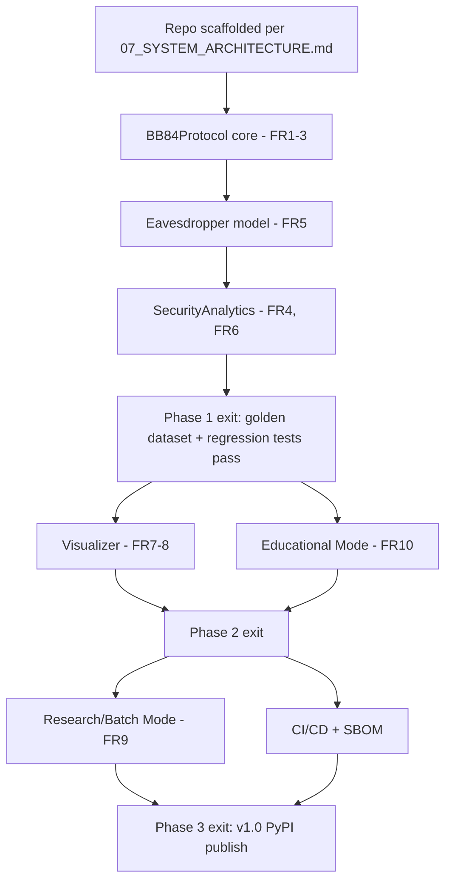

# 15 — Roadmap

**Version:** 0.2.0 | **Last Updated:** 2026-07-22 | **Author:** ParaDise
**Status:** Planned (Pre-Development) | **References:** `02_PRODUCT_BLUEPRINT.md`, `05_PRODUCT_REQUIREMENTS.md`

---

## Table of Contents
1. [Roadmap Overview](#1-roadmap-overview)
2. [Quarterly Roadmap View](#2-quarterly-roadmap-view)
3. [Phase 1 — Core Simulation](#3-phase-1--core-simulation)
4. [Phase 2 — Analytics, Visualization, Educational Mode](#4-phase-2--analytics-visualization-educational-mode)
5. [Phase 3 — Research Tooling & Distribution](#5-phase-3--research-tooling--distribution)
6. [Milestone Dependencies](#6-milestone-dependencies)
7. [Exit Criteria per Phase](#7-exit-criteria-per-phase)
8. [Technical Debt Backlog](#8-technical-debt-backlog)
9. [Risk-Adjusted Timeline](#9-risk-adjusted-timeline)
10. [Version Roadmap](#10-version-roadmap)
11. [Milestones](#11-milestones)
12. [Assumptions](#12-assumptions)
13. [Scope](#13-scope)
14. [References](#14-references)

---

## 1. Roadmap Overview

```mermaid
gantt
    title QST Roadmap (Planned — indicative sequencing, not calendar-committed)
    dateFormat  X
    axisFormat %s
    section Phase 1
    Core BB84 Engine           :p1, 0, 3
    section Phase 2
    Analytics + Viz + Edu Mode :p2, after p1, 3
    section Phase 3
    Research Tooling + PyPI    :p3, after p2, 3
```

> Durations above are relative sequencing units, not committed calendar time — no dates are promised, consistent with a solo-maintainer project.

## 2. Quarterly Roadmap View

> **Status: Planned/Illustrative.** Presented as relative quarters (Q1, Q2, Q3 *of the project*, not calendar quarters), since no start date is committed (see §9 Risk-Adjusted Timeline for why).

| Project Quarter | Focus | Roadmap Phase |
|---|---|---|
| Q1 | Repository scaffolding, `BB84Protocol`, `Eavesdropper`, core unit tests | Phase 1 |
| Q2 | `SecurityAnalytics`, `Visualizer`, Educational Mode, integration tests | Phase 2 |
| Q3 | Research/Batch Mode, CI/CD, SBOM, PyPI publish (v1.0) | Phase 3 |
| Q4+ | Backlog items from `20_FUTURE_ENHANCEMENTS.md`, contingent on adoption/bandwidth | Future (v2.0 candidate work) |

## 3. Phase 1 — Core Simulation

- Implement `BB84Protocol` (bit/basis generation, qubit prep, measurement, sifting) using Qiskit.
- Implement `Eavesdropper` intercept-resend model.
- Implement `SecurityAnalytics` (QBER, key rate).
- Unit test suite per `14_TESTING_STRATEGY.md` §3, especially the QBER acceptance criteria in `05_PRODUCT_REQUIREMENTS.md` §10.
- **Exit criteria:** see §7.

## 4. Phase 2 — Analytics, Visualization, Educational Mode

- Build `Visualizer` (basis tables, QBER-vs-interception charts).
- Build Educational Mode step-by-step narration (CLI).
- Expand test coverage to include integration tests.
- **Exit criteria:** see §7.

## 5. Phase 3 — Research Tooling & Distribution

- Batch/Research Mode with CSV/JSON export (FR-9).
- CI/CD pipeline (`13_DEPLOYMENT.md`), including SBOM generation (`11_SECURITY_ARCHITECTURE.md` §10).
- Package and publish to PyPI.
- **Exit criteria:** see §7.

## 6. Milestone Dependencies

**Critical path:** M0 → M1 → M2 → M3 → M4 — everything else in Phase 2/3 depends on the Phase 1 core being correct, since `SecurityAnalytics` and `Visualizer` both consume `BB84Protocol`/`Eavesdropper` output (per `07_SYSTEM_ARCHITECTURE.md` §7 Dependency Rules).

## 7. Exit Criteria per Phase

| Phase | Exit Criteria |
|---|---|
| Phase 1 | `05_PRODUCT_REQUIREMENTS.md` FR-1 through FR-6 and FR-13 implemented and tested; `14_TESTING_STRATEGY.md` §3 unit tests and §9 statistical validation pass; golden dataset (§8 of `14`) established |
| Phase 2 | FR-7 through FR-10 implemented; integration tests (`14_TESTING_STRATEGY.md` §4) pass; Educational Mode usable end-to-end by a persona-representative test user (see `02_PRODUCT_BLUEPRINT.md` §5) |
| Phase 3 | FR-9 (batch/export) complete; CI/CD (`13_DEPLOYMENT.md`) green on all matrix combinations (`06_TECHNICAL_REQUIREMENTS.md` §7); SBOM published; `19_RELEASE_PLAN.md` v1.0 criteria met |

No phase is considered exited until its criteria are met **and** `docs/` is updated to reflect reality (per `00_PROJECT_CONSTITUTION.md` §8 Definition of Done) — this prevents the documentation-first process from drifting out of sync with the implementation it was meant to guide.

## 8. Technical Debt Backlog

> **Status:** Empty at present — no code exists, so no debt has been incurred yet. This section exists as a placeholder to be populated during implementation, per the practice established in `01_REPOSITORY_AUDIT.md`.

| ID | Debt Item | Incurred In | Risk if Unaddressed |
|---|---|---|---|
| _(none yet)_ | — | — | — |

**Policy:** Any deliberate shortcut taken during implementation (e.g., "hardcode X for now, generalize later") must be logged here with the responsible phase/PR, not left as an undocumented TODO — consistent with the "no hidden information" spirit of `00_PROJECT_CONSTITUTION.md`.

## 9. Risk-Adjusted Timeline

Given `17_RISK_REGISTER.md` P-1 (single-maintainer bandwidth is High likelihood, Medium impact), this roadmap deliberately:

- Avoids calendar-date commitments (§1, §2) in favor of relative sequencing, so a bandwidth slip doesn't create a "broken promise" against a published date.
- Front-loads the highest-RICE-score features (per `02_PRODUCT_BLUEPRINT.md` §9.2 — Eavesdropper Simulation, Security Analytics) into Phase 1, so that even if the project stalls after Phase 1, the most pedagogically important claim (QBER-based eavesdropper detection) is already delivered and testable.
- Treats Phase 3 (distribution/PyPI) as lower urgency than Phase 1/2 correctness — a correct, well-tested toolkit that's harder to `pip install` is a better outcome than a widely-distributed toolkit with a subtly broken security demonstration.

## 10. Version Roadmap

| Version | Contents |
|---|---|
| v0.1 | Phase 1 core, unpublished, dev-only |
| v0.5 | Phase 2 complete, pre-release testing |
| v1.0 | Phase 3 complete, published to PyPI |
| v2.0 | Future enhancements (see `20_FUTURE_ENHANCEMENTS.md`) — additional protocols, optional AI tutor, web dashboard |

## 11. Milestones

- **M1:** First reproducible BB84 simulation run with correct QBER behavior under Eve — proves the core pedagogical claim works in code.
- **M2:** First Educational Mode walkthrough usable by a non-quantum-expert learner.
- **M3:** First PyPI-published release.

## 12. Assumptions

- Phases are sequential due to single-maintainer bandwidth; no parallel workstreams assumed.
- The Technical Debt Backlog (§8) will be actively maintained once implementation starts, not treated as a one-time artifact.

## 13. Scope

High-level sequencing only; detailed release contents are in `19_RELEASE_PLAN.md`.

## 14. References

- `05_PRODUCT_REQUIREMENTS.md`
- `19_RELEASE_PLAN.md`
- `20_FUTURE_ENHANCEMENTS.md`
- `17_RISK_REGISTER.md`
- `14_TESTING_STRATEGY.md`

---

## Implementation Status

| Phase | Status |
|---|---|
| Phase 1 | Not started |
| Phase 2 | Not started |
| Phase 3 | Not started |

## Future Improvements

- Introduce estimated calendar timelines once Phase 1 velocity is observed.
- Populate the Technical Debt Backlog (§8) as real debt is incurred during implementation.

## Document Improvements

This revision (0.2.0) added: a Quarterly Roadmap View (§2), a Milestone Dependencies graph showing the critical path (§6), explicit Exit Criteria per Phase (§7), a Technical Debt Backlog placeholder with policy (§8), and a Risk-Adjusted Timeline explaining sequencing rationale against `17_RISK_REGISTER.md` (§9). All original content (Roadmap Overview, Phase 1-3 descriptions, Version Roadmap, Milestones, Assumptions, Scope, References) is preserved unchanged.
