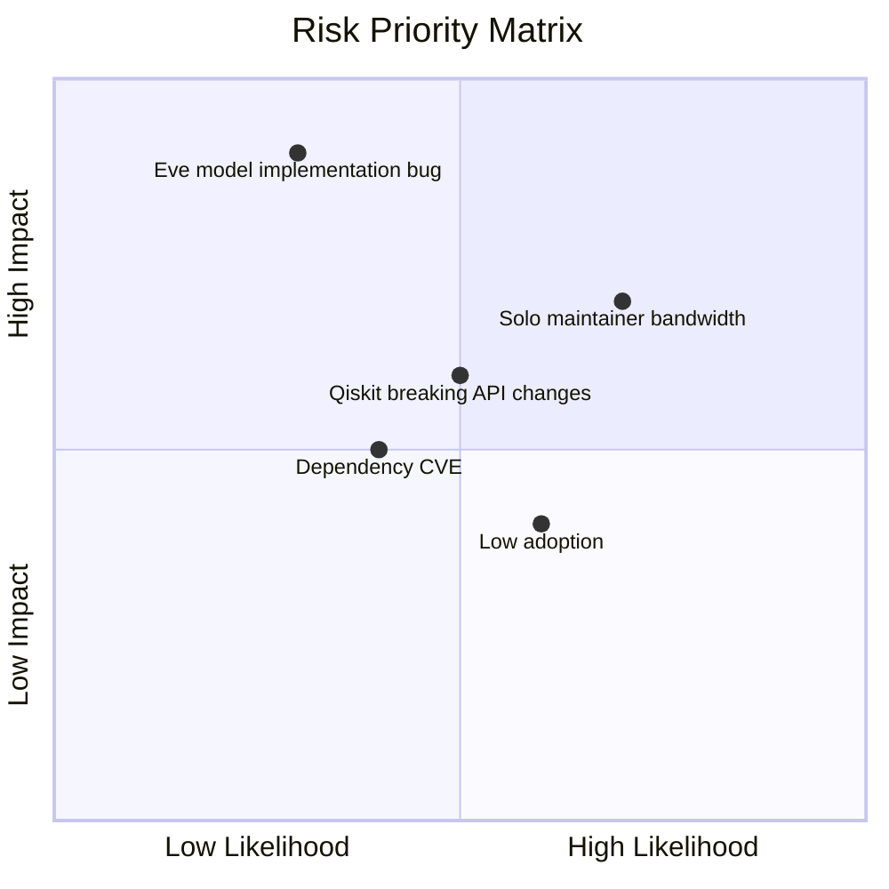

# 17 — Risk Register

**Version:** 0.2.0 | **Last Updated:** 2026-07-22 | **Author:** ParaDise
**Status:** Living Document | **References:** `11_SECURITY_ARCHITECTURE.md`, `00_PROJECT_CONSTITUTION.md`

---

## Table of Contents
1. [Risk Matrix](#1-risk-matrix)
2. [Risk Register Fields Explained](#2-risk-register-fields-explained)
3. [Technical Risks](#3-technical-risks)
4. [Security Risks](#4-security-risks)
5. [Project Risks](#5-project-risks)
6. [Review Frequency](#6-review-frequency)
7. [Assumptions](#7-assumptions)
8. [Scope](#8-scope)
9. [References](#9-references)

---

## 1. Risk Matrix

## 2. Risk Register Fields Explained

Each risk below is now tracked with four additional fields, alongside the original Likelihood/Impact/Mitigation:

- **Owner:** who is responsible for watching/acting on this risk. At the current single-maintainer stage, this is the project owner (ParaDise) for every risk — this field becomes meaningful once contributors/maintainers are added, at which point ownership should be reassigned explicitly rather than defaulting to whoever last edited a file.
- **Trigger:** the observable event/condition that indicates the risk is materializing (as opposed to Likelihood, which is a general estimate).
- **Contingency:** the fallback action if the risk materializes despite mitigation.
- **Review Frequency:** how often this specific risk should be re-assessed (see §6 for the overall cadence policy).

## 3. Technical Risks

| ID | Risk | Likelihood | Impact | Owner | Trigger | Mitigation | Contingency | Review Frequency |
|---|---|---|---|---|---|---|---|---|
| T-1 | Qiskit major-version API changes break simulation code | Medium | Medium | ParaDise | A pinned Qiskit version is marked end-of-life, or CI fails after a routine dependency bump | Pin versions; monitor Qiskit release notes; add compatibility tests (`06_TECHNICAL_REQUIREMENTS.md` §7) | Freeze QST on the last known-compatible Qiskit version and schedule a dedicated migration PR rather than patching reactively | Each Qiskit minor release |
| T-2 | Performance degrades at high qubit counts (statevector simulation scaling) | Medium | Medium | ParaDise | Benchmark run (`14_TESTING_STRATEGY.md` §11) exceeds NFR-1 target | Benchmark early (Phase 1); document practical qubit-count limits (`05_PRODUCT_REQUIREMENTS.md` EC-6) | Lower the documented "recommended max qubit count" and clearly surface it in CLI help text rather than silently letting users hit long runtimes | Each Phase 1 benchmark run, then per release |
| T-3 | Eavesdropper model implemented incorrectly, silently breaking the pedagogical claim | Low-Medium | High | ParaDise | Golden dataset (`14_TESTING_STRATEGY.md` §8) or statistical validation (`14` §9) test fails | Mandatory regression tests per `11_SECURITY_ARCHITECTURE.md` §4 and `14_TESTING_STRATEGY.md` §3 | Block the release, revert the offending change, and re-derive the golden dataset only after the fix is independently verified against theory | Every PR touching `core/` |

## 4. Security Risks

| ID | Risk | Likelihood | Impact | Owner | Trigger | Mitigation | Contingency | Review Frequency |
|---|---|---|---|---|---|---|---|---|
| S-1 | Dependency supply-chain vulnerability (Qiskit or transitive dep) | Medium | Medium | ParaDise | `pip-audit` (`11_SECURITY_ARCHITECTURE.md` §10) flags a new CVE in CI | `pip-audit` in CI; pinned versions (`13_DEPLOYMENT.md`) | Patch/pin to a fixed version immediately and issue a patch release; publish a security advisory per `11_SECURITY_ARCHITECTURE.md` §11 | Continuous (CI, every PR + scheduled scan) |
| S-2 | Users mistake QST for a production-grade QKD security product | Medium | Medium | ParaDise | A GitHub issue, forum post, or user message treats QST output as a real security guarantee | Explicit documentation disclaimers (`11_SECURITY_ARCHITECTURE.md` §12) | Add a runtime warning banner in Educational Mode output reiterating the simulator-only, educational nature of results | Each release / on report |

## 5. Project Risks

| ID | Risk | Likelihood | Impact | Owner | Trigger | Mitigation | Contingency | Review Frequency |
|---|---|---|---|---|---|---|---|---|
| P-1 | Single-maintainer bandwidth limits delivery speed | High | Medium | ParaDise | A phase (`15_ROADMAP.md`) remains open significantly longer than its predecessor took | Phased roadmap (`15_ROADMAP.md`) scoped to sustainable increments; risk-adjusted timeline (`15` §9) | Re-scope the current phase down to its Must-priority items only (`02_PRODUCT_BLUEPRINT.md` §9.1 MoSCoW) and defer the rest | Per phase |
| P-2 | Low adoption / limited community contribution | Medium | Low-Medium | ParaDise | Near-zero external stars/issues/PRs several months after v1.0 | Documentation-first approach intended to lower contributor onboarding cost | Focus outreach on university/course-adoption channels specifically (per `02_PRODUCT_BLUEPRINT.md` §4 target audience) rather than broad marketing | Quarterly (see §6) |
| P-3 | Scope creep (AI Tutor, web dashboard, etc. pulled forward before core is solid) | Medium | Medium | ParaDise | A Future-tagged item (`20_FUTURE_ENHANCEMENTS.md`) is started before its phase's exit criteria (`15_ROADMAP.md` §7) are met | Strict phase gating in `15_ROADMAP.md`; Future items explicitly deprioritized in `20_FUTURE_ENHANCEMENTS.md` | Explicitly reject/park the out-of-order work item in `15_ROADMAP.md` §8 Technical Debt Backlog or `20_FUTURE_ENHANCEMENTS.md`, rather than letting it silently merge | Per PR (self-check against MoSCoW) |

## 6. Review Frequency

Beyond the per-risk cadence noted in the tables above, the **entire risk register** should be reviewed as a whole:

- At the exit of every roadmap phase (`15_ROADMAP.md` §7), since new risks typically surface once a phase's real implementation challenges become visible.
- On any security disclosure (`11_SECURITY_ARCHITECTURE.md` §11), to check whether the incident reveals an unlisted risk.
- At minimum, once per project quarter (`15_ROADMAP.md` §2), even if no trigger has fired, to catch risks that have quietly changed likelihood/impact without a discrete triggering event.

## 7. Assumptions

- Risk likelihood/impact ratings are qualitative judgment calls by the project owner, not derived from incident history (none exists yet for a pre-development project).
- Ownership defaults entirely to the project owner at this stage; this is a known simplification to revisit once the contributor base grows (see §2).

## 8. Scope

Covers known, anticipated risks as of this document's version. This is a living document to be updated as the project progresses.

## 9. References

- `11_SECURITY_ARCHITECTURE.md`
- `15_ROADMAP.md`
- `20_FUTURE_ENHANCEMENTS.md`

---

## Implementation Status

| Item | Status |
|---|---|
| This risk register | Current (qualitative, pre-development) |
| Owner/Trigger/Contingency/Review-Frequency fields | Current (added this revision) |
| Incident-history-informed risk data | Not available (no history exists) |

## Future Improvements

- Update likelihood/impact ratings using real incident/bug data after Phase 1 ships.
- Reassign risk ownership across multiple maintainers once the contributor base grows beyond the project owner.

## Document Improvements

This revision (0.2.0) added: Owner, Trigger, Contingency, and Review Frequency columns to every risk in the Technical, Security, and Project risk tables (§3–§5), plus a dedicated Review Frequency policy section (§6) explaining the overall review cadence. All original content (Risk Matrix, the three risk categories' original Risk/Likelihood/Impact/Mitigation content, Assumptions, Scope, References) is preserved unchanged — no existing risk row was removed, only extended.
