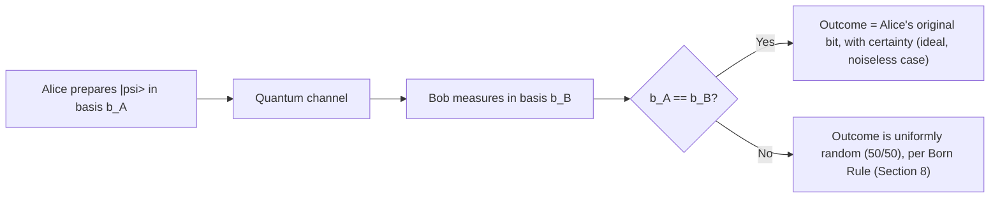

# 22 — Mathematical Foundation

**Version:** 0.1.0 | **Last Updated:** 2026-07-22 | **Author:** ParaDise
**Status:** Reference (theory is well-established; QST's *implementation* of it is Planned) | **References:** `../specs/BB84_SPEC.md`, `../specs/QBER_SPEC.md`, `11_SECURITY_ARCHITECTURE.md`

---

## Table of Contents
1. [Purpose](#1-purpose)
2. [Linear Algebra Review](#2-linear-algebra-review)
3. [Complex Numbers](#3-complex-numbers)
4. [Dirac Notation](#4-dirac-notation)
5. [Hilbert Space](#5-hilbert-space)
6. [Qubit Representation](#6-qubit-representation)
7. [Quantum States & Superposition](#7-quantum-states--superposition)
8. [Measurement Postulate & Born Rule](#8-measurement-postulate--born-rule)
9. [Computational Basis & Hadamard Basis](#9-computational-basis--hadamard-basis)
10. [Pauli Gates](#10-pauli-gates)
11. [Hadamard Gate Derivation](#11-hadamard-gate-derivation)
12. [Quantum Measurement in BB84](#12-quantum-measurement-in-bb84)
13. [BB84 Mathematical Proof (Security Sketch)](#13-bb84-mathematical-proof-security-sketch)
14. [QBER Mathematical Derivation](#14-qber-mathematical-derivation)
15. [Shannon Entropy](#15-shannon-entropy)
16. [Mutual Information & Information Leakage](#16-mutual-information--information-leakage)
17. [Privacy Amplification (Mathematical Sketch)](#17-privacy-amplification-mathematical-sketch)
18. [Error Correction Overview](#18-error-correction-overview)
19. [Security Proof Overview](#19-security-proof-overview)
20. [Assumptions](#20-assumptions)
21. [References](#21-references)

---

## 1. Purpose

This document provides the mathematical grounding that `../specs/BB84_SPEC.md` and `../specs/QBER_SPEC.md` implement against. It exists so a contributor can verify an implementation is *mathematically* correct, not just that it passes unit tests written by the same person who wrote the code. The mathematics here is well-established physics/information theory (decades old, textbook-standard) — what is **Planned**, not Current, is QST's *code* that implements it (see `01_REPOSITORY_AUDIT.md`).

## 2. Linear Algebra Review

A qubit's state lives in a 2-dimensional complex vector space $\mathbb{C}^2$. Standard linear-algebra objects used throughout this document:

- **Vector:** $|\psi\rangle \in \mathbb{C}^2$, represented as a column vector $\begin{pmatrix}\alpha \\ \beta\end{pmatrix}$.
- **Inner product:** $\langle \phi | \psi \rangle = \phi_0^* \psi_0 + \phi_1^* \psi_1$, where $^*$ denotes complex conjugate.
- **Unitary matrix:** $U$ such that $U^\dagger U = I$ ($U^\dagger$ = conjugate transpose) — all quantum gates (§10, §11) are unitary, which is why quantum evolution is reversible until measurement.
- **Tensor product** ($\otimes$): used to describe multi-qubit systems, e.g., $|0\rangle \otimes |1\rangle = |01\rangle$. BB84 as specified in `../specs/BB84_SPEC.md` operates on independent single qubits, so tensor products of *entangled* states are not required for the core protocol (see §5 Assumptions).

## 3. Complex Numbers

Quantum amplitudes are complex numbers $\alpha = a + bi$ where $i = \sqrt{-1}$. The physically meaningful quantity is $|\alpha|^2 = \alpha^* \alpha = a^2 + b^2$ (the Born Rule, §8) — a real, non-negative probability. Complex phase (the *argument* of $\alpha$) has no effect on measurement probability in the computational basis alone but matters for interference effects exploited by the Hadamard basis (§9).

## 4. Dirac Notation

- **Ket** $|\psi\rangle$: a column vector representing a quantum state.
- **Bra** $\langle\psi|$: the conjugate transpose (row vector) of $|\psi\rangle$, i.e., $\langle\psi| = |\psi\rangle^\dagger$.
- **Bra-ket** $\langle\phi|\psi\rangle$: the inner product (§2), a complex number giving the overlap between two states.

All qubit states in this document and in `../specs/BB84_SPEC.md` are written in Dirac notation for consistency with the physics literature (Nielsen & Chuang [1], §21).

## 5. Hilbert Space

A single qubit's state space is the Hilbert space $\mathcal{H} = \mathbb{C}^2$: a complex vector space equipped with an inner product (§2), complete under the norm it induces. The two orthonormal basis vectors $|0\rangle$ and $|1\rangle$ (§9) span this space. BB84 as implemented does not require reasoning about infinite-dimensional or multi-qubit joint Hilbert spaces, since each qubit is prepared, transmitted, and measured independently (see `../specs/BB84_SPEC.md` §1 — no entanglement is used, distinguishing BB84 from entanglement-based protocols like E91, noted as Future in `20_FUTURE_ENHANCEMENTS.md`).

## 6. Qubit Representation

A qubit's state is any unit vector in $\mathbb{C}^2$:

$$|\psi\rangle = \alpha|0\rangle + \beta|1\rangle, \quad \alpha, \beta \in \mathbb{C}, \quad |\alpha|^2 + |\beta|^2 = 1$$

The Bloch sphere is a common geometric visualization of this state space (referenced as a Planned visualization feature in `../specs/VISUALIZATION_SPEC.md` §1, Future full interactivity per `12_UI_UX_DESIGN.md` §6).

## 7. Quantum States & Superposition

"Superposition" refers to a state $|\psi\rangle = \alpha|0\rangle + \beta|1\rangle$ where both $\alpha$ and $\beta$ are non-zero — the qubit is not definitely $|0\rangle$ or $|1\rangle$ until measured. BB84's diagonal (Hadamard) basis states, $|+\rangle$ and $|-\rangle$ (§9), are canonical examples of superposition states relative to the computational basis.

## 8. Measurement Postulate & Born Rule

Measuring $|\psi\rangle = \alpha|0\rangle + \beta|1\rangle$ in the computational basis yields:

$$P(\text{outcome} = 0) = |\alpha|^2, \qquad P(\text{outcome} = 1) = |\beta|^2$$

This is the **Born Rule**. After measurement, the state *collapses* to the observed basis state ($|0\rangle$ or $|1\rangle$) — the original superposition is destroyed. This collapse, applied to a *wrong-basis* measurement, is the entire mathematical source of BB84's security (§13).

## 9. Computational Basis & Hadamard Basis

| Basis | State for bit 0 | State for bit 1 |
|---|---|---|
| Computational (Z / rectilinear) | $|0\rangle = \begin{pmatrix}1\\0\end{pmatrix}$ | $|1\rangle = \begin{pmatrix}0\\1\end{pmatrix}$ |
| Hadamard (X / diagonal) | $\|+\rangle = \frac{1}{\sqrt{2}}(\|0\rangle + \|1\rangle)$ | $\|-\rangle = \frac{1}{\sqrt{2}}(\|0\rangle - \|1\rangle)$ |

This matches `../specs/BB84_SPEC.md` §2's encoding table exactly — that table is the implementation-facing restatement of these two orthonormal bases.

**Key mathematical fact used throughout BB84's security argument:** the Z-basis and X-basis are *mutually unbiased* — a state prepared in one basis, measured in the other, yields each outcome with exactly 50% probability, regardless of which specific state (0 or 1) was prepared:

$$|\langle 0|+\rangle|^2 = |\langle 0|-\rangle|^2 = |\langle 1|+\rangle|^2 = |\langle 1|-\rangle|^2 = \frac{1}{2}$$

## 10. Pauli Gates

| Gate | Matrix | Effect |
|---|---|---|
| $X$ (bit flip) | $\begin{pmatrix}0&1\\1&0\end{pmatrix}$ | $\|0\rangle \leftrightarrow \|1\rangle$ |
| $Z$ (phase flip) | $\begin{pmatrix}1&0\\0&-1\end{pmatrix}$ | $\|+\rangle \leftrightarrow \|-\rangle$ |
| $Y$ | $\begin{pmatrix}0&-i\\i&0\end{pmatrix}$ | Combined bit+phase flip |

The $X$ gate is used in `../specs/BB84_SPEC.md` §3's reference pseudocode (`qc.x(0)`) to encode bit value 1 before basis rotation.

## 11. Hadamard Gate Derivation

The Hadamard gate $H = \frac{1}{\sqrt{2}}\begin{pmatrix}1&1\\1&-1\end{pmatrix}$ transforms between the computational and Hadamard bases:

$$H|0\rangle = \frac{1}{\sqrt{2}}(|0\rangle + |1\rangle) = |+\rangle, \qquad H|1\rangle = \frac{1}{\sqrt{2}}(|0\rangle - |1\rangle) = |-\rangle$$

**Derivation of self-inverse property** ($H^2 = I$), which is why `../specs/BB84_SPEC.md` §3's `measure_qubit()` re-applies $H$ before measuring in the X basis:

$$H \cdot H = \frac{1}{2}\begin{pmatrix}1&1\\1&-1\end{pmatrix}\begin{pmatrix}1&1\\1&-1\end{pmatrix} = \frac{1}{2}\begin{pmatrix}2&0\\0&2\end{pmatrix} = I$$

Applying $H$ once rotates *into* the Hadamard basis (state preparation); applying $H$ again *before measuring* rotates back into the computational basis so a standard Z-basis measurement correctly reads out the X-basis-encoded bit — exactly the reference implementation shape shown in `../specs/BB84_SPEC.md` §3.

## 12. Quantum Measurement in BB84

This is the mathematical mechanism `../specs/BB84_SPEC.md` §1 step 6 implements, and the reason sifting (step 8) discards mismatched-basis measurements: they carry no reliable information about Alice's original bit.

## 13. BB84 Mathematical Proof (Security Sketch)

This is a **sketch**, not a full cryptographic security proof (a rigorous information-theoretic security proof — e.g., following Shor–Preskill [2] — is well beyond a documentation-suite's scope and is not reproduced here to avoid a misleadingly "complete" but actually truncated proof; see §19 and §21 for pointers to the canonical proofs).

**Core argument, informally:**

1. Eve does not know Alice's basis choice for a given qubit before it is measured (§9's mutual unbiasedness).
2. By the no-cloning theorem [3], Eve cannot copy the unknown qubit state to measure it in both bases "just in case" — she must commit to *one* measurement basis, guessing.
3. If Eve guesses the wrong basis (50% of the time, per §9), her measurement — by the Born Rule (§8) — collapses the state randomly, and her re-prepared qubit (per `../specs/BB84_SPEC.md` §5, step E4) will, with 50% probability, disagree with Alice's original bit when Bob later measures in the *same* basis Alice used.
4. This yields Eve introducing a detectable error with probability $\frac{1}{2} \times \frac{1}{2} = \frac{1}{4}$ per intercepted qubit (derived precisely in §14).
5. Because this error rate is statistically detectable via a public sample comparison (`../specs/QBER_SPEC.md`), Alice and Bob can bound the amount of information Eve could plausibly have gained, and use privacy amplification (§17) to reduce that leaked amount to information-theoretic negligibility.

## 14. QBER Mathematical Derivation

For a qubit intercepted by Eve using the intercept-resend strategy (`../specs/BB84_SPEC.md` §5):

$$P(\text{Eve's basis} = \text{Alice's basis}) = \frac{1}{2} \implies \text{Bob receives Eve's correctly-reconstructed qubit}$$
$$P(\text{Eve's basis} \neq \text{Alice's basis}) = \frac{1}{2} \implies \text{Bob receives a randomized qubit}$$

Conditioned on Bob measuring in the *same* basis Alice used (the only case survives sifting):

$$P(\text{Bob's bit} \neq \text{Alice's bit} \mid \text{intercepted}) = P(\text{Eve wrong basis}) \times P(\text{Bob wrong bit} \mid \text{Eve wrong basis}) = \frac{1}{2} \times \frac{1}{2} = \frac{1}{4}$$

So for `eve_intercept_probability = 1.0` (full interception, per `../docs/05_PRODUCT_REQUIREMENTS.md` §10 acceptance criteria):

$$\text{QBER} \approx 25\%$$

For partial interception with probability $p$ (`eve_intercept_probability = p`), the expected QBER scales linearly:

$$\text{QBER}(p) \approx p \times \frac{1}{4}$$

This linear relationship is the mathematical basis for `../specs/QBER_SPEC.md` §7's property-based test ("QBER scales monotonically with interception probability") and `../docs/14_TESTING_STRATEGY.md` §5's monotonic-trend invariant.

## 15. Shannon Entropy

$$H(X) = -\sum_{x} P(x) \log_2 P(x)$$

Shannon entropy quantifies the uncertainty in a random variable (e.g., Alice's raw bit string) in bits. For an ideal, uniformly random bit, $H(X) = 1$ bit. This is the foundational quantity behind §16 (Mutual Information) and §17 (Privacy Amplification).

## 16. Mutual Information & Information Leakage

$$I(A;E) = H(A) - H(A|E)$$

$I(A;E)$ is the mutual information between Alice's key $A$ and Eve's knowledge $E$ — an upper bound on how many bits of the final key Eve could plausibly know, estimated from the observed QBER. Real BB84 security proofs (§19, §21) derive an explicit bound on $I(A;E)$ as a function of QBER; QST's v1.0 scope (per `../docs/11_SECURITY_ARCHITECTURE.md` §12) reports QBER itself but does **not** implement this bound calculation — doing so correctly requires the full security-proof machinery referenced in §19, and a naive/incomplete implementation would risk giving a false sense of rigor. This is explicitly marked **Future** (see `20_FUTURE_ENHANCEMENTS.md`).

## 17. Privacy Amplification (Mathematical Sketch)

Given a sifted, error-corrected key of length $n$ with an estimated Eve-information bound of $t$ bits (§16), privacy amplification uses a randomly chosen **universal hash function** $h: \{0,1\}^n \to \{0,1\}^{n-t-s}$ (for a security parameter $s$) to compress the key, provably reducing Eve's expected information about the final, shorter key to at most $2^{-s}$ (a standard leftover hash lemma argument [4]). As stated in `../docs/11_SECURITY_ARCHITECTURE.md` §7 and §12, **QST does not implement privacy amplification in v1.0** — this section documents the mathematics for the Future feature noted there, so a future contributor implementing it has the correct target to build against rather than inventing an ad hoc compression scheme.

## 18. Error Correction Overview

Real QKD deployments run classical error correction (e.g., Cascade or a linear error-correcting code) on the sifted key *before* privacy amplification, to reconcile the small number of natural-channel-noise-induced mismatches between Alice's and Bob's sifted keys (distinct from the sampled-and-discarded bits used for QBER estimation in `../specs/QBER_SPEC.md`). QST's simulator-based, near-noiseless channel model (per `../docs/06_TECHNICAL_REQUIREMENTS.md` §5) makes this largely unnecessary for the core educational simulation — it is documented here as **Future** context (aligned with `20_FUTURE_ENHANCEMENTS.md`'s noise-model roadmap item), not a v1.0 gap requiring immediate action.

## 19. Security Proof Overview

Full information-theoretic security proofs for BB84 (e.g., Mayers [5], Shor–Preskill [2], Renner [6]) establish that, under standard assumptions (§20), an adversary's information about the final key can be made exponentially small in the security parameter via privacy amplification (§17), even against an adversary with unbounded computational power. **This document does not reproduce those proofs** — doing so is out of scope for a documentation suite and would risk an inaccurate, oversimplified restatement of genuinely subtle information-theoretic arguments. Contributors needing the full proof should consult §21's references directly.

## 20. Assumptions

- The classical channel used for basis reconciliation and sampling is authenticated (not necessarily secret) — a standard BB84 assumption also stated in `../docs/11_SECURITY_ARCHITECTURE.md` §3, not re-derived here.
- Qubits are simulated as ideal, isolated 2-level systems with no entanglement between them, consistent with `../specs/BB84_SPEC.md`'s per-qubit independent treatment (§5 above).
- The intercept-resend attack model is the only eavesdropping strategy mathematically treated in §13–14; more general/optimal attacks (relevant to the full security proofs in §19) are out of scope for QST's v1.0 simulation (see `../docs/11_SECURITY_ARCHITECTURE.md` §3).

## 21. References

> Full bibliographic detail (APA, BibTeX, DOI) for each citation below is maintained centrally in `23_REFERENCES.md` to avoid duplicating citation metadata across documents — this section lists only which canonical source underlies which piece of mathematics above, per `23_REFERENCES.md`'s "Purpose of reference" / "Where used" fields.

| Ref | Used For |
|---|---|
| [1] Nielsen & Chuang, *Quantum Computation and Quantum Information* | §2–§11 general quantum mechanics formalism |
| [2] Shor & Preskill, security proof of BB84 | §13, §19 |
| [3] Wootters & Zurek, no-cloning theorem | §13 |
| [4] Impagliazzo, Levin, Luby / Bennett et al., leftover hash lemma | §17 |
| [5] Mayers, unconditional security of BB84 | §19 |
| [6] Renner, security proofs via smooth entropies | §19 |

---

## Implementation Status

| Item | Status |
|---|---|
| Mathematics documented in this file | Current (established literature, not QST-original research) |
| QBER linear-scaling relationship (§14) as implemented in code | Planned — implements against `../specs/QBER_SPEC.md` |
| Mutual information / Eve-information bound calculation (§16) | Future — not in v1.0 scope |
| Privacy amplification (§17) | Future |
| Error correction (§18) | Future |
| Full security proof reproduction (§19) | Explicitly out of scope — reference pointers only |

## Future Improvements

- Implement the mutual-information bound (§16) and privacy amplification (§17) once QST moves beyond the educational-simulation scope defined in `../docs/11_SECURITY_ARCHITECTURE.md` §12, per `20_FUTURE_ENHANCEMENTS.md`.

## Document Improvements

This is a new document (v0.1.0), created in Phase 3 of the documentation-enrichment process. It integrates with, and does not duplicate, `../specs/BB84_SPEC.md` (implementation contract) and `../specs/QBER_SPEC.md` (metric computation contract) by providing the mathematical derivations those specs assume but do not re-derive themselves.
