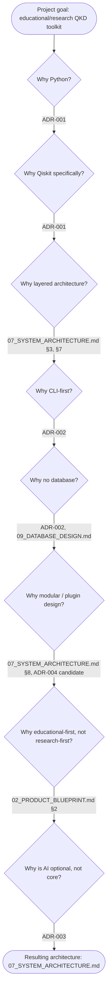

# 25 — Architecture Decision Tree

**Version:** 0.1.0 | **Last Updated:** 2026-07-22 | **Author:** ParaDise
**Status:** Reference (visual companion to `18_DECISION_LOG.md` and `24_ADR_INDEX.md`) | **References:** `18_DECISION_LOG.md`, `24_ADR_INDEX.md`, `07_SYSTEM_ARCHITECTURE.md`

---

## Table of Contents
1. [Purpose](#1-purpose)
2. [The Decision Tree](#2-the-decision-tree)
3. [Per-Decision Detail](#3-per-decision-detail)
4. [Assumptions](#4-assumptions)
5. [Scope](#5-scope)
6. [References](#6-references)

---

## 1. Purpose

`18_DECISION_LOG.md` documents each architectural decision independently. This document shows how they **chain together** — each decision narrowing the space of what the next decision needed to answer — as a single visual flow, so a new contributor can see the *shape* of the reasoning in one glance before reading the full ADRs.

## 2. The Decision Tree

## 3. Per-Decision Detail

### Why Python?

- **Context:** Need a language accessible to the target audience (students, researchers — `02_PRODUCT_BLUEPRINT.md` §4) with strong scientific-computing tooling.
- **Alternatives:** C++/Q# (higher performance, much higher barrier to entry for the target audience).
- **Tradeoffs:** Python trades raw execution speed for accessibility and ecosystem fit (numpy, matplotlib already assumed elsewhere in the stack — `06_TECHNICAL_REQUIREMENTS.md` §2).
- **Why selected:** Matches audience skill profile and existing Qiskit ecosystem convention (see next).
- **Future review trigger:** Only if performance benchmarks (`28_PERFORMANCE_BENCHMARK_PLAN.md`) reveal Python is a hard bottleneck even with Qiskit Aer's compiled backend — considered unlikely for the target qubit-count ranges in `05_PRODUCT_REQUIREMENTS.md` NFR-1, but not ruled out.
- **Governing ADR:** ADR-001 (`18_DECISION_LOG.md`).

### Why Qiskit specifically?

- **Context:** Given Python is chosen, which quantum SDK?
- **Alternatives:** Cirq, PennyLane (see ADR-001's Alternatives field for full detail — not re-derived here).
- **Tradeoffs:** Qiskit's academic-tutorial ecosystem dominance vs. a more rigorous, benchmarked comparison that was not performed (an honestly-disclosed limitation, per ADR-001's Cons field).
- **Why selected:** Ecosystem fit + maintainer familiarity (speed of delivery for a solo-maintainer project — `17_RISK_REGISTER.md` P-1).
- **Future review trigger:** A Qiskit breaking change requiring significant rework, or v2.0 planning.
- **Governing ADR:** ADR-001.

### Why layered architecture?

- **Context:** Given Python + Qiskit, how should the codebase be internally organized to keep protocol correctness (the toolkit's whole value proposition) reviewable in isolation?
- **Alternatives:** A flatter, single-module script (faster to write initially, harder to test/extend — directly conflicts with the extensibility goal in `00_PROJECT_CONSTITUTION.md`).
- **Tradeoffs:** More upfront structure/boilerplate vs. long-term testability and the Dependency Rules enforceable in `07_SYSTEM_ARCHITECTURE.md` §7.
- **Why selected:** Directly supports the "core domain logic reviewable independent of UI" principle central to `11_SECURITY_ARCHITECTURE.md` §4's critical-correctness note.
- **Future review trigger:** None currently scheduled — considered a stable, low-risk architectural choice.
- **Governing document:** `07_SYSTEM_ARCHITECTURE.md` §3, §7 (this decision was not retroactively written up as a numbered ADR in `18_DECISION_LOG.md`; it is a candidate for a future ADR-005 if it is ever seriously revisited).

### Why CLI-first?

- **Context:** Given a layered library architecture exists, what is the primary user-facing interface?
- **Alternatives:** Web dashboard as the primary interface (see ADR-002 Alternatives).
- **Tradeoffs:** Lower initial reach/polish vs. zero hosting cost and a better match to how the target audience already works (`18_DECISION_LOG.md` ADR-002 Pros/Cons).
- **Why selected:** Matches audience workflow; avoids infrastructure burden for a solo maintainer.
- **Future review trigger:** v2.0 planning, contingent on `20_FUTURE_ENHANCEMENTS.md` web-dashboard demand.
- **Governing ADR:** ADR-002.

### Why no database?

- **Context:** Given CLI/library-first, does the toolkit need persistent storage?
- **Alternatives:** SQLite-backed result history from day one (see `09_DATABASE_DESIGN.md` §3 Future ER diagram).
- **Tradeoffs:** No cross-session result browsing vs. zero added dependency/complexity for a stateless, reproducible-by-seed tool.
- **Why selected:** Simulation runs are fully reproducible from parameters + seed (`../specs/BB84_SPEC.md` §4) — persistence adds no correctness value, only convenience, and convenience isn't worth the complexity at v1.0.
- **Future review trigger:** Only if a Future multi-session web dashboard is built (`09_DATABASE_DESIGN.md` §3).
- **Governing:** ADR-002 (consequence), `09_DATABASE_DESIGN.md`.

### Why modular / plugin design?

- **Context:** Given the long-term vision includes multiple QKD protocols (`02_PRODUCT_BLUEPRINT.md` §11), how should extensibility be designed in?
- **Alternatives:** Hard-code BB84 only and refactor later when/if a second protocol is actually needed.
- **Tradeoffs:** Upfront design investment (the `ProtocolInterface`, `07_SYSTEM_ARCHITECTURE.md` §8) vs. avoiding a costly retrofit later.
- **Why selected:** The stated long-term vision explicitly includes protocol extensibility; designing the seam now is cheaper than a breaking refactor after BB84-specific assumptions calcify into the codebase.
- **Future review trigger:** When the registry mechanism (dict vs. entry-points, `../specs/SIMULATION_SPEC.md` §2) is finalized — candidate ADR-004 (`24_ADR_INDEX.md`).
- **Governing:** `07_SYSTEM_ARCHITECTURE.md` §8, ADR-004 (candidate).

### Why educational-first, not research-first?

- **Context:** Given limited solo-maintainer bandwidth (`17_RISK_REGISTER.md` P-1), which user segment's needs get built first?
- **Alternatives:** Research/Batch Mode first (would serve `02_PRODUCT_BLUEPRINT.md` §5's "Dr. Verma" persona before "Ananya").
- **Tradeoffs:** Research Mode has fewer, more advanced users; Educational Mode reaches the larger, more foundational audience and directly demonstrates the core pedagogical claim (`11_SECURITY_ARCHITECTURE.md` §4).
- **Why selected:** `15_ROADMAP.md` §9's risk-adjusted timeline explicitly front-loads the highest-RICE-score, most pedagogically important features; Research Mode (FR-9) is Phase 3, not Phase 1/2.
- **Future review trigger:** None scheduled — this ordering is considered stable through v1.0.
- **Governing:** `02_PRODUCT_BLUEPRINT.md` §2, `15_ROADMAP.md` §3–§5, §9.

### Why is AI optional, not core?

- **Context:** Given an Educational Mode exists, should AI (e.g., natural-language explanation) be built into it from day one?
- **Alternatives:** Building an LLM-based explanation layer into `SimulationOrchestrator` from the start (see ADR-003 Alternatives).
- **Tradeoffs:** A potentially valuable learning aid deferred vs. keeping the core simulation fully transparent, deterministic, and free of external API dependency/cost.
- **Why selected:** Transparency is a stated Core Principle (`00_PROJECT_CONSTITUTION.md` §4); AI-generated explanations of a physics result would undermine the "no fabricated claims" ethos if not clearly bounded as optional and separate from the ground-truth computation.
- **Future review trigger:** Once Educational Mode (non-AI) ships and user feedback indicates demand (`08_AI_ARCHITECTURE.md` Future Improvements).
- **Governing ADR:** ADR-003.

## 4. Assumptions

- The "Why layered architecture?" and "Why educational-first?" nodes are documented here and cross-referenced to their governing sections, but do not yet have a dedicated numbered ADR in `18_DECISION_LOG.md` — this is flagged explicitly (see §3) rather than silently implying they do.

## 5. Scope

Visual/narrative companion only. `18_DECISION_LOG.md` remains the single source of truth for full ADR detail; this document must not be treated as authoritative if it and the log ever disagree (same rule as `24_ADR_INDEX.md`, §3).

## 6. References

- `18_DECISION_LOG.md`
- `24_ADR_INDEX.md`
- `07_SYSTEM_ARCHITECTURE.md`
- `02_PRODUCT_BLUEPRINT.md`
- `15_ROADMAP.md`

---

## Implementation Status

| Item | Status |
|---|---|
| This decision tree | Current (design-stage reasoning, documented) |
| Underlying architecture it describes | Planned (not yet implemented — see `01_REPOSITORY_AUDIT.md`) |

## Future Improvements

- Formalize "Why layered architecture?" and "Why educational-first?" as numbered ADRs in `18_DECISION_LOG.md` if either is ever seriously contested/revisited, rather than leaving them as undedicated narrative-only decisions.

## Document Improvements

This is a new document (v0.1.0), created in Phase 3. It provides a visual chained-decision view that did not exist before — `18_DECISION_LOG.md`'s ADRs were previously documented independently with no single diagram showing how one decision's outcome fed into the next.
