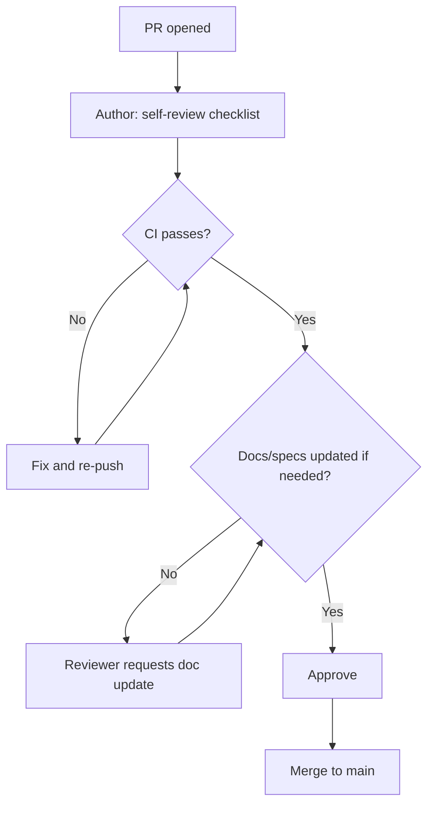

# 27 — Contributor Guide (Internal Engineering Guide)

**Version:** 0.1.0 | **Last Updated:** 2026-07-22 | **Author:** ParaDise
**Status:** Reference | **References:** `00_PROJECT_CONSTITUTION.md`, `16_CODING_STANDARDS.md`, `14_TESTING_STRATEGY.md`

---

## Table of Contents
1. [Purpose — How This Differs from CONTRIBUTING.md](#1-purpose--how-this-differs-from-contributingmd)
2. [Repository Philosophy](#2-repository-philosophy)
3. [Architecture Philosophy](#3-architecture-philosophy)
4. [Folder Structure Walkthrough](#4-folder-structure-walkthrough)
5. [Development Lifecycle](#5-development-lifecycle)
6. [How Documentation Should Be Updated](#6-how-documentation-should-be-updated)
7. [How Specifications Should Evolve](#7-how-specifications-should-evolve)
8. [Engineering Principles](#8-engineering-principles)
9. [Definition of Done](#9-definition-of-done)
10. [Code Review Expectations](#10-code-review-expectations)
11. [Testing Expectations](#11-testing-expectations)
12. [Documentation Expectations](#12-documentation-expectations)
13. [PR Review Flow](#13-pr-review-flow)
14. [Release Workflow](#14-release-workflow)
15. [Assumptions](#15-assumptions)
16. [Scope](#16-scope)
17. [References](#17-references)

---

## 1. Purpose — How This Differs from CONTRIBUTING.md

`CONTRIBUTING.md` (Phase 4, repository root) is the short, external-facing "how to submit a PR" guide any GitHub visitor sees. **This document is the internal engineering guide** — the reasoning behind the process, not just the steps — intended for anyone doing sustained engineering work on QST (including the project owner's future self). If the two ever seem to conflict, `CONTRIBUTING.md` should be corrected to match this document, since this is the canonical source of the *why*.

## 2. Repository Philosophy

QST is documentation-first by deliberate choice (`00_PROJECT_CONSTITUTION.md` §1): the full `docs/` and `specs/` suite existed before a single line of implementation code, so that every implementation decision has a pre-agreed target to build against rather than being invented ad hoc mid-PR. This is unusual for a solo-maintainer open-source project and is a conscious trade-off — slower initial velocity in exchange for an auditable, extensible foundation (see `18_DECISION_LOG.md` reasoning patterns generally).

## 3. Architecture Philosophy

The layered architecture (`07_SYSTEM_ARCHITECTURE.md` §3) exists to keep the security-critical protocol logic (`core/`) reviewable in isolation from UI/orchestration concerns. When in doubt about where new code belongs, the test is: **"Could this code's correctness be verified by someone who has never seen a CLI flag or a matplotlib chart?"** If yes, it belongs in `core/` or `analytics/`. If the answer depends on how a result is displayed or invoked, it belongs in `visualization/`, `cli/`, or `orchestration/`.

## 4. Folder Structure Walkthrough

```
quantum-security-toolkit/
├── docs/          # Narrative documentation (this suite) — the "why" and "what"
├── specs/         # Implementation contracts — the precise "how", code-facing
├── src/qst/       # Actual implementation (Planned — does not exist yet, see 01_REPOSITORY_AUDIT.md)
├── tests/         # Unit, integration, property-based, golden-dataset tests (14_TESTING_STRATEGY.md)
├── examples/      # Educational walkthroughs, notebooks
└── .github/       # Issue/PR templates, CI workflows (Phase 4)
```

A contributor unsure whether a change belongs in `docs/` or `specs/`: `docs/` explains reasoning, trade-offs, and context for *humans* deciding what to build; `specs/` gives exact, low-ambiguity contracts for *implementing* something already decided. If you're writing "why we chose X over Y," that's `docs/`. If you're writing "this function must return exactly this shape," that's `specs/`.

## 5. Development Lifecycle


## 6. How Documentation Should Be Updated

- **Never leave `docs/` stale.** Per `00_PROJECT_CONSTITUTION.md` NFR-4, any code change that alters behavior described in a `docs/` file must update that file in the *same* PR.
- **Enrich, don't rewrite.** When adding to an existing document, preserve all prior content, add new sections in a logical place, and append a "Document Improvements" note — this is the pattern established across the 00–21 and 22–32 documents and should continue for all future edits.
- **Version bump on meaningful change.** Increment the document's version number (semantic-ish: a new section is a minor bump, a typo fix is not necessarily version-bumped) and update "Last Updated."
- **New terminology → `26_PROJECT_GLOSSARY.md` in the same PR** — do not let new terms accumulate undocumented.

## 7. How Specifications Should Evolve

- `specs/*.md` files are contracts, not documentation of "however it happens to work today." If an implementation detail changes in a way that alters the contract (e.g., the batch continue-vs-abort default in `../specs/SIMULATION_SPEC.md` §4), the spec must be updated *before or in the same PR as* the code change — not after, and not left silently inconsistent.
- Any spec item marked "To Be Implemented" or "To Be Decided" should be resolved (with the decision recorded) the first time an implementation PR actually needs that decision — don't let an implementation quietly diverge from an unresolved spec placeholder.
- A new module (e.g., a Future `E91Protocol`) should get its own `specs/E91_SPEC.md`, following the structure/tone of `../specs/BB84_SPEC.md`, not be crammed into an existing spec file.

## 8. Engineering Principles

Restated and applied from `00_PROJECT_CONSTITUTION.md` §4:

1. Correctness over cleverness — especially in `core/`.
2. No fabricated claims — in code comments, docstrings, and commit messages, exactly as in documentation.
3. Reproducibility — every simulation result must trace back to a fixed seed and documented parameters.
4. Security-critical code (`core/`, `analytics/`) gets extra review scrutiny per `11_SECURITY_ARCHITECTURE.md` §4's critical-correctness note.

## 9. Definition of Done

Identical to `00_PROJECT_CONSTITUTION.md` §8 — restated here for convenience, not redefined:

1. Merged to `main` with tests passing.
2. Public functions have type hints and docstrings.
3. Relevant `docs/`/`specs/` updated.
4. Test coverage meets `14_TESTING_STRATEGY.md` §12 targets.
5. Security-relevant code checked against `11_SECURITY_ARCHITECTURE.md`.
6. CHANGELOG entry added (mechanism per `13_DEPLOYMENT.md` §6).

## 10. Code Review Expectations

Follow the checklist in `16_CODING_STANDARDS.md` §10 verbatim — this guide does not duplicate it, only points to it as the canonical review checklist every PR (self-reviewed today, peer-reviewed once contributors join) must satisfy.

## 11. Testing Expectations

- Any PR touching `core/` or `analytics/` must include the relevant regression tests from `14_TESTING_STRATEGY.md` §3 and, where applicable, the statistical validation checks in §9 — these are **blocking**, not optional, per `11_SECURITY_ARCHITECTURE.md` §4.
- Coverage targets (`14_TESTING_STRATEGY.md` §12) are checked in CI once it exists (`13_DEPLOYMENT.md`); until then, self-reported coverage numbers should be included in the PR description.

## 12. Documentation Expectations

- Every PR description should state which `docs/`/`specs/` files were reviewed and, if none needed updating, explicitly say so ("No docs impact — internal refactor only") rather than leaving it ambiguous whether documentation was considered at all.

## 13. PR Review Flow



At the current single-maintainer stage, "Reviewer" and "Author" are the same person exercising deliberate self-review discipline — this flow becomes a literal two-person process once external contributors are onboarded, without needing to change the flow itself.

## 14. Release Workflow

Identical to `13_DEPLOYMENT.md` §6 — restated as a pointer, not a second copy: merge → CHANGELOG → semantic version tag → CI builds and publishes to PyPI, per `19_RELEASE_PLAN.md`.

## 15. Assumptions

- This guide assumes familiarity with `00_PROJECT_CONSTITUTION.md`, `07_SYSTEM_ARCHITECTURE.md`, and `16_CODING_STANDARDS.md` as prerequisites — it is not a substitute for reading those, only a synthesis of how they apply day-to-day.

## 16. Scope

Internal engineering process only. External contribution mechanics (how to open a PR, code of conduct) are in the Phase 4 GitHub files (`CONTRIBUTING.md`, `CODE_OF_CONDUCT.md`).

## 17. References

- `00_PROJECT_CONSTITUTION.md`
- `07_SYSTEM_ARCHITECTURE.md`
- `16_CODING_STANDARDS.md`
- `14_TESTING_STRATEGY.md`
- `13_DEPLOYMENT.md`
- `19_RELEASE_PLAN.md`

---

## Implementation Status

| Item | Status |
|---|---|
| This guide | Current (process defined; not yet exercised — no PRs have been submitted, as no repository exists) |

## Future Improvements

- Convert the self-review checklist references into an actual GitHub PR template checklist once `.github/PULL_REQUEST_TEMPLATE.md` (Phase 4) is in active use.

## Document Improvements

This is a new document (v0.1.0), created in Phase 3. It is distinct from the Phase 4 `CONTRIBUTING.md` (external, procedural) by design — this document carries the internal reasoning and synthesizes existing standards (`16_CODING_STANDARDS.md`, `14_TESTING_STRATEGY.md`, `13_DEPLOYMENT.md`) into one engineering-lifecycle narrative without duplicating their detailed content.
