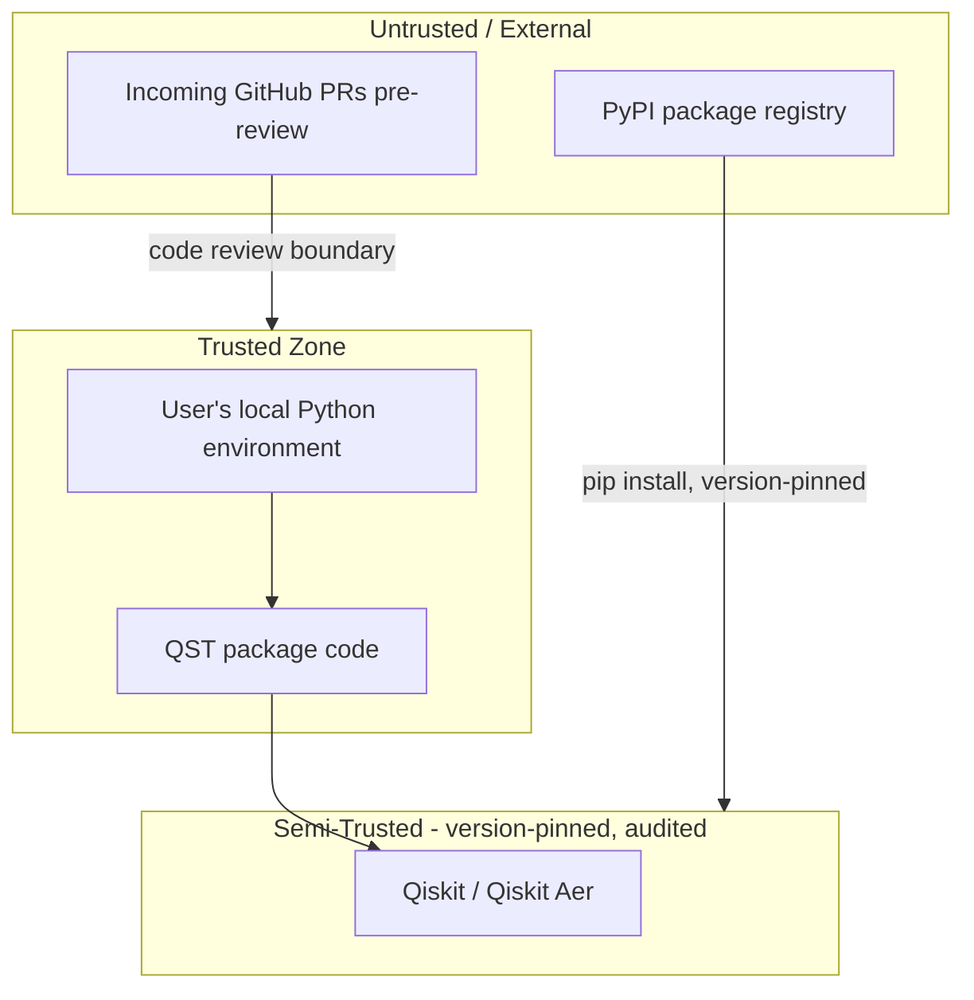
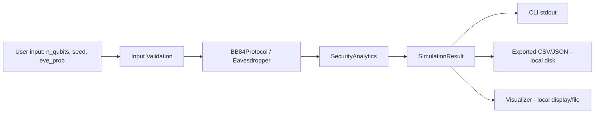
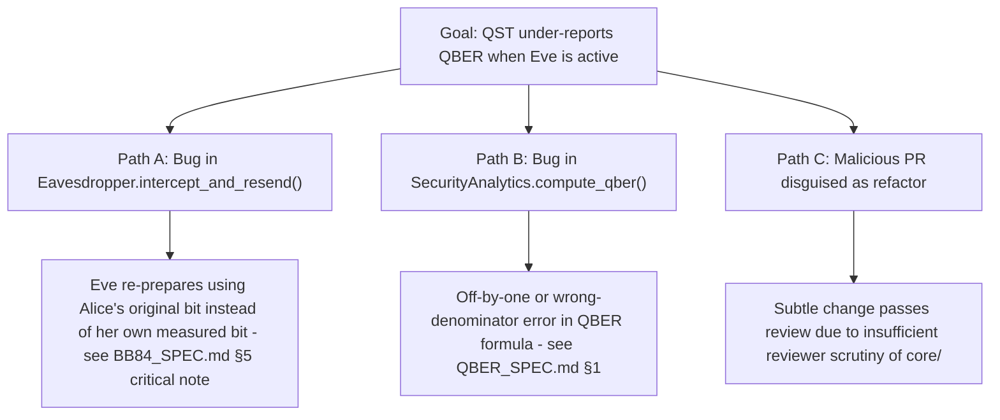
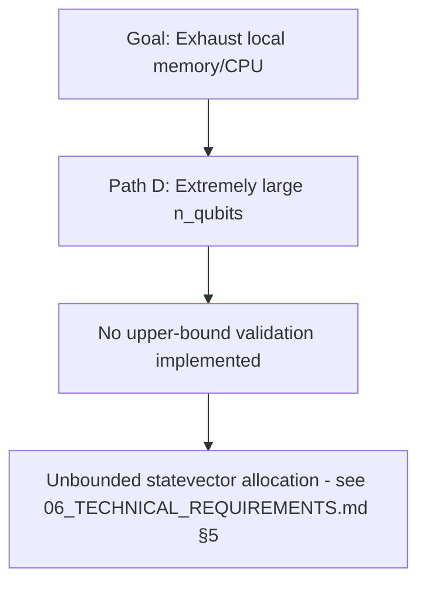

# 29 — Threat Model

**Version:** 0.1.0 | **Last Updated:** 2026-07-22 | **Author:** ParaDise
**Status:** Design (Pre-Development) | **References:** `11_SECURITY_ARCHITECTURE.md`, `17_RISK_REGISTER.md`

---

## Table of Contents
1. [Purpose — Relationship to 11_SECURITY_ARCHITECTURE.md](#1-purpose--relationship-to-11_security_architecturemd)
2. [Assets](#2-assets)
3. [Threat Actors](#3-threat-actors)
4. [Trust Boundaries](#4-trust-boundaries)
5. [Data Flow Diagram](#5-data-flow-diagram)
6. [Attack Surface](#6-attack-surface)
7. [Attack Trees](#7-attack-trees)
8. [STRIDE (Reference, Not Duplicated)](#8-stride-reference-not-duplicated)
9. [Misuse Cases](#9-misuse-cases)
10. [Security Assumptions](#10-security-assumptions)
11. [Threat Prioritization](#11-threat-prioritization)
12. [Residual Risks](#12-residual-risks)
13. [Future Risks](#13-future-risks)
14. [Assumptions](#14-assumptions)
15. [Scope](#15-scope)
16. [References](#16-references)

---

## 1. Purpose — Relationship to 11_SECURITY_ARCHITECTURE.md

`11_SECURITY_ARCHITECTURE.md` establishes QST's security *architecture*: the dual security context (protocol vs. software), STRIDE analysis, secure SDLC, SBOM strategy, and disclosure workflow. This document is a dedicated **threat model**, focused on formal threat-modeling artifacts (assets, actors, trust boundaries, data-flow diagrams, attack trees, misuse cases) that `11` does not itself provide at this level of formality. Where content would otherwise duplicate `11` (notably STRIDE), this document references it directly rather than reproducing it (see §8).

## 2. Assets

| Asset | Description | Sensitivity |
|---|---|---|
| Simulation correctness | The guarantee that `BB84Protocol`/`Eavesdropper` correctly model the real protocol's security properties | Critical — a broken guarantee here silently invalidates the toolkit's entire purpose (per `11_SECURITY_ARCHITECTURE.md` §4) |
| Exported result data | CSV/JSON files from Research Mode (`../specs/EXPORT_SPEC.md`) | Low — simulation artifacts, not real secrets (see §10) |
| Package integrity | The PyPI-published QST package itself | Medium — a compromised release would affect all downstream users |
| Maintainer credentials (GitHub, PyPI) | Access enabling malicious releases | High — though outside QST's own codebase, a standard supply-chain asset any maintainer must protect |
| Documentation accuracy | The trustworthiness of `docs/`/`specs/` themselves as a teaching resource | Medium-High — inaccurate documentation could itself mislead learners about QKD security properties |

## 3. Threat Actors

| Actor | Motivation | Capability |
|---|---|---|
| Careless/malicious contributor | Introduces a bug (accidental) or a subtle logic flaw (deliberate) into `core/` | Code-level access via PR (low barrier at OSS scale) |
| Compromised dependency maintainer | A transitive dependency (Qiskit or below) is compromised upstream | Supply-chain level, outside QST's direct control — mitigated via `11_SECURITY_ARCHITECTURE.md` §10 |
| Curious/malicious end user | Attempts to crash or misuse the local tool (e.g., resource-exhaustion input) | Local-only, no elevated privilege — bounded impact (see §6) |
| Automated scanner/bot (PyPI/GitHub) | Not a threat in the traditional sense but a relevant actor for supply-chain hygiene monitoring (dependabot-style bots) | N/A — treated as a defensive tool, not an adversary |

**Explicitly out of scope:** network attackers, nation-state actors, and physical-access attackers are not meaningfully applicable threat actors for a locally-run, offline Python educational toolkit with no production deployment (consistent with `11_SECURITY_ARCHITECTURE.md` §7's ATT&CK scoping).

## 4. Trust Boundaries

The most important boundary for QST's specific risk profile is **GitHub PR → merged `main`**: this is where the "careless/malicious contributor" threat actor (§3) is checked via the code review process (`16_CODING_STANDARDS.md` §10, `27_CONTRIBUTOR_GUIDE.md` §10).

## 5. Data Flow Diagram

No data crosses a network boundary anywhere in this flow (per `11_SECURITY_ARCHITECTURE.md` §6 — no networked component in scope), which is the single most important fact shaping this threat model's low overall severity relative to a networked product.

## 6. Attack Surface

| Surface | Exposed To | Notes |
|---|---|---|
| CLI argument parsing | Local user only | Validated per `05_PRODUCT_REQUIREMENTS.md` FR-13, `../specs/CLI_SPEC.md` §6 |
| Python library API parameters | Any code importing `qst` | Same validation boundary as CLI, per `../specs/SIMULATION_SPEC.md` §1 |
| Export file writing | Local filesystem | See `../specs/EXPORT_SPEC.md` §4 — standard library serializers only |
| Dependency tree | Indirect, via PyPI | Primary supply-chain surface — see `11_SECURITY_ARCHITECTURE.md` §10 |

No network listener, no authentication surface, no multi-tenant data store exists — the attack surface is deliberately minimal by architectural choice (ADR-002, `18_DECISION_LOG.md`).

## 7. Attack Trees

### 7.1 Goal: Cause QST to under-report QBER (undermining the pedagogical claim)

**Mitigations mapped:** A1 and B1 are directly guarded by the golden dataset and statistical validation tests (`14_TESTING_STRATEGY.md` §8–§9); C1 is guarded by the mandatory review checklist item in `16_CODING_STANDARDS.md` §10 specifically calling out `core/`/`Eavesdropper` changes.

### 7.2 Goal: Cause a denial-of-service via resource exhaustion

**Mitigation mapped:** input validation with sane upper bounds (`05_PRODUCT_REQUIREMENTS.md` EC-6, STRIDE DoS row in `11_SECURITY_ARCHITECTURE.md` §6).

## 8. STRIDE (Reference, Not Duplicated)

The full STRIDE analysis for QST-as-software is authoritatively maintained in `11_SECURITY_ARCHITECTURE.md` §6 — it is not reproduced here to avoid two independently-maintained (and potentially drifting) copies of the same table. This threat model's attack trees (§7) are the STRIDE "Tampering" and "Denial of Service" rows expanded into concrete attacker-path detail.

## 9. Misuse Cases

| Misuse Case | Description | Mitigation |
|---|---|---|
| "I'll cite QST's QBER output as proof my real hardware is secure" | A user mistakes the educational simulator for a production security assessment tool | Explicit disclaimers (`11_SECURITY_ARCHITECTURE.md` §12) and STRIDE S-2 mitigation (`17_RISK_REGISTER.md` S-2) |
| "I'll run a batch sweep with an absurd qubit count to see what happens" | Non-malicious but resource-exhausting exploratory use | Input validation ceiling (§7.2, `05_PRODUCT_REQUIREMENTS.md` EC-6) |
| "I'll submit a PR that looks like a harmless refactor but subtly breaks the Eve model" | Malicious or careless contribution undermining the core claim | Review checklist + golden dataset (§7.1) |

## 10. Security Assumptions

- The classical channel abstraction (basis reconciliation, sampling) is assumed authenticated, per `11_SECURITY_ARCHITECTURE.md` §3 and `22_MATHEMATICAL_FOUNDATION.md` §20 — QST does not model an attacker who can tamper with this classical channel.
- Exported result files are treated as low-sensitivity simulation artifacts, not secrets requiring protection at rest (§2) — this assumption should be revisited if a Future feature ever exports anything resembling a real cryptographic key rather than a simulation demonstration key.

## 11. Threat Prioritization

| Threat (from §7 attack trees) | Priority | Rationale |
|---|---|---|
| A1 (Eve model implementation bug) | **Highest** | Directly undermines the toolkit's core purpose; matches `17_RISK_REGISTER.md` T-3 (Low-Medium likelihood, High impact) |
| B1 (QBER formula bug) | **High** | Same class of impact as A1, slightly more mechanically simple to catch via unit tests |
| C1 (malicious PR bypassing review) | Medium | Low likelihood at current solo-maintainer stage (no external PRs yet), rising in likelihood once contributors join |
| D (resource exhaustion) | Medium-Low | Bounded impact (local DoS only, no data loss or confidentiality breach) |

## 12. Residual Risks

Even with all planned mitigations (§7's mapped mitigations, `11_SECURITY_ARCHITECTURE.md` full stack) implemented:

- A sufficiently subtle bug in `core/` could theoretically pass both unit tests and statistical validation if it happens to preserve aggregate QBER statistics while being locally incorrect — an inherent limitation of statistical/property-based testing (`14_TESTING_STRATEGY.md` §5, §9) that mutation testing (§6 of `14`) is intended to partially address, though no testing regime eliminates this risk entirely.
- Dependency supply-chain risk (§3) can never be fully eliminated, only monitored and responded to quickly (`11_SECURITY_ARCHITECTURE.md` §10).

## 13. Future Risks

- If a Future networked feature (AI Tutor API calls, web dashboard) is added, this threat model must be revisited — new trust boundaries (§4) and attack surface (§6) would be introduced that do not exist in the current offline-only design.
- If Future entanglement-based protocols (E91) are added, new assets (entangled-state correctness) and attack trees specific to that protocol's security properties would need to be added, following this document's pattern.

## 14. Assumptions

- This threat model assumes the architecture described in `07_SYSTEM_ARCHITECTURE.md` is implemented as designed; any architectural deviation during implementation should trigger a re-review of this document's trust boundaries (§4) and attack surface (§6).

## 15. Scope

Formal threat-modeling artifacts only. Security architecture, secure SDLC, and disclosure process remain owned by `11_SECURITY_ARCHITECTURE.md`.

## 16. References

- `11_SECURITY_ARCHITECTURE.md`
- `17_RISK_REGISTER.md`
- `../specs/BB84_SPEC.md` §5
- `../specs/QBER_SPEC.md` §1
- `14_TESTING_STRATEGY.md` §6, §8, §9

---

## Implementation Status

| Item | Status |
|---|---|
| This threat model | Current (design-stage analysis) |
| Mitigations mapped to attack trees | Planned (implementation-dependent — see referenced specs) |

## Future Improvements

- Revisit trust boundaries and attack surface if any networked feature is added (§13).
- Add a dedicated attack tree for entanglement-based protocols if/when E91 support is implemented.

## Document Improvements

This is a new document (v0.1.0), created in Phase 3. It adds assets, threat actors, trust boundaries, a data-flow diagram, attack trees, misuse cases, and threat prioritization/residual-risk analysis that did not exist before — none of which duplicates `11_SECURITY_ARCHITECTURE.md`'s STRIDE table, which this document explicitly references rather than reproduces (§8).
